# Rexarr documentation

> [!WARNING]
> Rexarr is in **beta**. Settings, file layout and the API can still change between releases – keep backups
> (System → Backup) and read the release notes before updating.

This is the full guide. For a quick overview see the [README](../README.md).

**Remux-first transcoding for the \*arr stack.** Rexarr sits next to Radarr and Sonarr, finds Blu-ray remux
releases for the titles you pick, and re-encodes them with FFmpeg using profiles you control – container, video
encoder, quality, audio encoder, subtitles – with built-in presets for movies, TV and anime.

```
Search (Radarr / Sonarr / Prowlarr)  →  remux-only results  →  Grab
        ↓
*arr downloads & imports the remux
        ↓
Rexarr notices the import  →  ffprobe  →  ffmpeg with your profile  →  optional replace + rescan
```

## Features

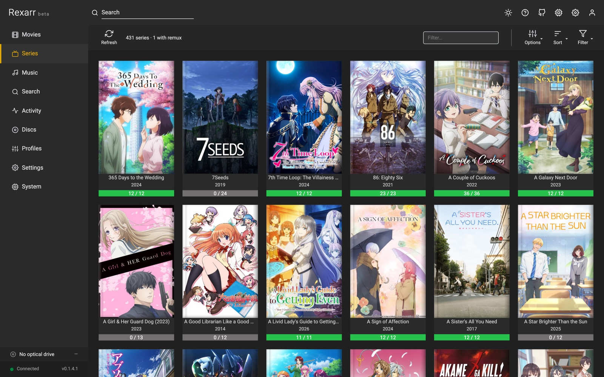

| | |
| :---: | :---: |
| 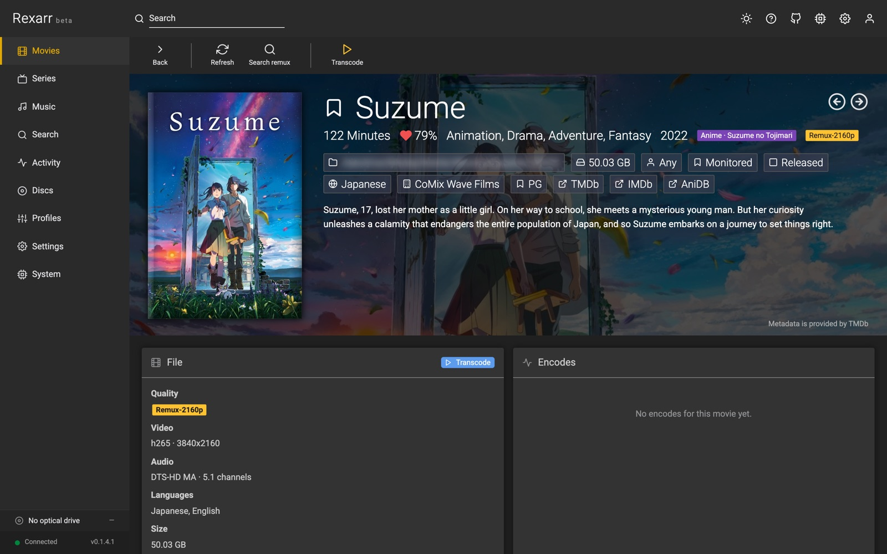<br>Movie details | 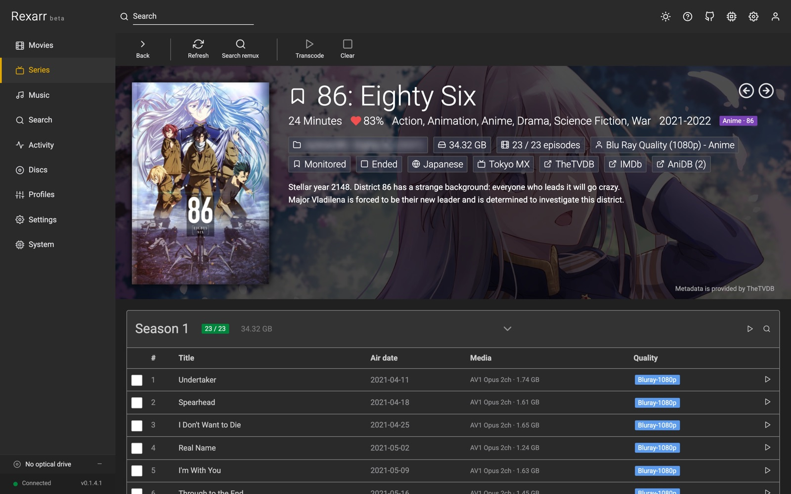<br>Series details |
| 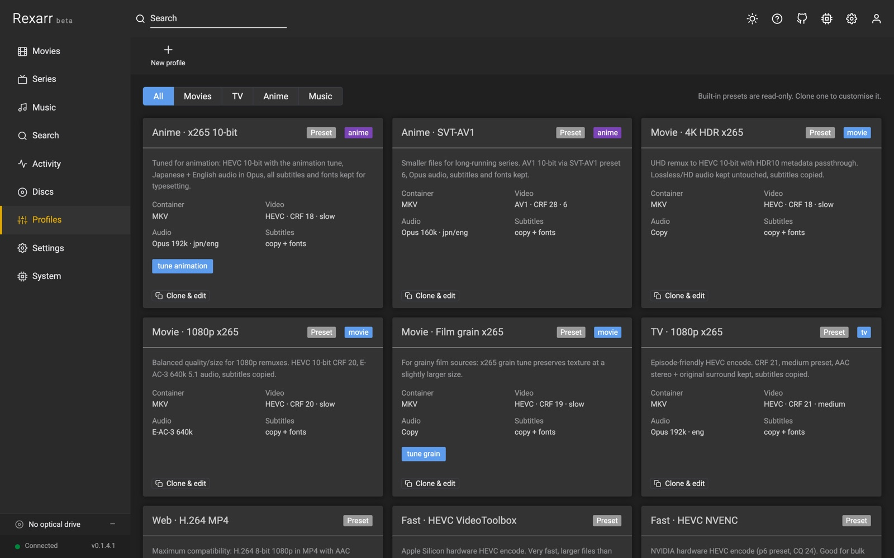<br>Encoding profiles | 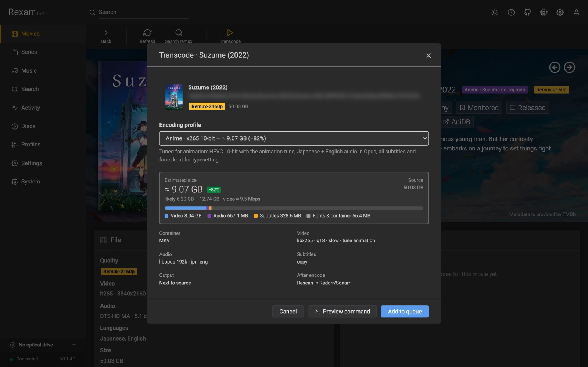<br>Transcode dialog with estimated size |

- **Web UI in the \*arr style** – Movies, Series, Search, Activity, Profiles, Settings, System.
- **Remux-only search** – interactive search through Radarr / Sonarr (and raw Prowlarr search),
  filtered to `Remux-1080p`, `Remux-2160p`, `Bluray-1080p Remux`, `REMUX` titles, etc.
- **Smart search** – one box for your library and TMDB / TVDB. It understands `Frieren S01E05`, `Dune (2021) 4k dv`,
  `Akira iso`, `tt1856101` / `tmdb:` / `tvdb:` ids, matches alternate and AniDB romaji titles with typos, and ranks
  releases (see *Search* below).
- **Full-disc (ISO) releases** – `BR-DISK`, `COMPLETE.BLURAY`, BD25/50/66/100, BD-ISO, BDMV, DVD5/DVD9/DVDR and
  VIDEO_TS releases are recognised too. Grabbed discs are ripped with MakeMKV when the download finishes, then
  transcoded and imported (see below).
- **Automatic pipeline** – grab a release, Rexarr polls the \*arr app until the file is imported,
  then queues the encode. Season packs expand into one job per episode.
- **Library view** – see which movies / episodes already have a remux on disk and transcode them
  (single, multi-select, whole season).
- **Profiles** – container (MKV / MP4 / WebM / MOV), video encoder (x264, x265, SVT-AV1, libaom,
  VP9, VideoToolbox, NVENC, QuickSync, VAAPI, AMF, or copy), CRF / CQ / quality, preset, tune,
  pixel format (8 / 10-bit), downscale, HDR10 passthrough, audio encoder (copy, AAC, Opus, E-AC-3,
  AC-3, FLAC, TrueHD) with bitrate / channels / language selection / commentary dropping,
  subtitle handling (copy, text-only, burn-in, none) with font attachments for anime, output
  directory / suffix / replace original / rescan in \*arr.
- **Built-in presets** – Anime x265 10-bit (animation tune, jpn+eng Opus, fonts kept), Anime
  SVT-AV1, Movie 4K HDR, Movie 1080p, Film grain, TV 1080p, Web MP4, VideoToolbox, NVENC,
  audio-only re-encode. Clone any preset to customise it.
- **Live progress** – percent, fps, speed, ETA and the full ffmpeg log streamed to the UI.
- **Command preview** – see the exact ffmpeg command a profile produces, against a sample UHD
  remux or a real file on disk.
- **Path mappings** – translate Docker / remote \*arr paths to local paths.
- **Disc ripping** – ARM-style: insert a disc, Rexarr identifies it, rips it with MakeMKV, transcodes it and
  hands it to Radarr / Sonarr.
- **Music** – Lidarr library (artists, albums, tracks with format / bit depth / sample rate / MQA), album search
  through Lidarr's indexers and Soulseek (slskd), audio CD ripping to FLAC with MusicBrainz tags and cover art, and
  music profiles encoded with fre:ac using open-source codecs only (FLAC, WavPack, Monkey's Audio, LAME MP3, Opus,
  Vorbis). See *Music* below.

## Transcoding and hardware acceleration

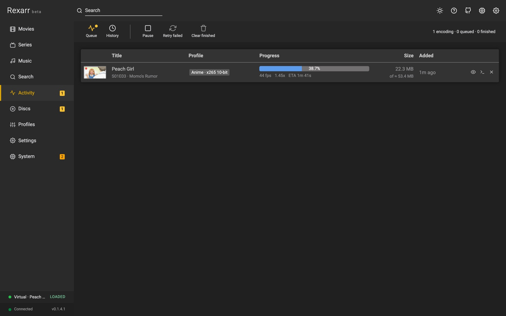

**Software (CPU) encoding is highly recommended for the best quality.** x265 and SVT-AV1 give noticeably smaller files
at the same visual quality than any hardware encoder, which is what you want when archiving Blu-ray remuxes. Hardware
encoding is many times faster but typically needs 20–40% more bitrate for the same quality; use it for speed or bulk
conversions.

**Settings → Encoding → Transcoding**:

| Hardware acceleration | Encoders | Device | Where |
| --- | --- | --- | --- |
| None | x264 / x265 / SVT-AV1 | – | everywhere (default) |
| AMD AMF | `h264_amf`, `hevc_amf`, `av1_amf` | default | Windows (Linux with AMF) |
| Nvidia NVENC | `h264_nvenc`, `hevc_nvenc`, `av1_nvenc` | GPU index (`nvidia-smi` detected) | Windows, Linux |
| Intel Quicksync (QSV) | `h264_qsv`, `hevc_qsv`, `av1_qsv` | render node | Windows, Linux |
| Video Acceleration API (VAAPI) | `h264_vaapi`, `hevc_vaapi`, `av1_vaapi` | render node (`/dev/dri/renderD*` detected) | Linux (Intel, AMD) |
| Rockchip MPP (RKMPP) | `h264_rkmpp`, `hevc_rkmpp` | default | Rockchip SoCs (needs e.g. jellyfin-ffmpeg) |
| Apple VideoToolBox | `h264_videotoolbox`, `hevc_videotoolbox` | default | macOS (not in Docker) |
| Video4Linux2 (V4L2) | `h264_v4l2m2m`, `hevc_v4l2m2m` | default | Raspberry Pi / SoCs, bitrate only |

- Profiles written for x264 / x265 / SVT-AV1 are encoded with the selected method's encoder for the same codec;
  quality (CRF → CQ / QP / global_quality / -q:v) and preset are translated. A codec the method cannot encode (e.g. AV1
  on VideoToolbox) stays on the CPU with a warning. Profiles that name a hardware encoder directly keep it.
- Set a profile to **Software only (CPU)** in its editor to keep it off the GPU regardless of this setting.
- **Hardware decoding** decodes H.264 / HEVC / AV1 / VP9 on the GPU as well; VAAPI keeps frames on the GPU end to end
  (`scale_vaapi`) unless subtitles are burned in. Other codecs are decoded on the CPU automatically.
- **Fall back to software**: a failed hardware encode is retried on the CPU (logged in the job and under Events).
- **Test** encodes 3 seconds of a 1080p pattern with the chosen method, device and decoding, and shows the fps or the
  exact ffmpeg error. Methods missing from the ffmpeg build are marked in the dropdown and flagged by the health check.
- Docker: pass `/dev/dri` for QSV / VAAPI (the image's ffmpeg includes VAAPI; Intel drivers on amd64). NVENC needs an
  ffmpeg with CUDA and the NVIDIA container runtime. RKMPP / V4L2 need an ffmpeg built for the board.

## Encode preview

| | |
| :---: | :---: |
| 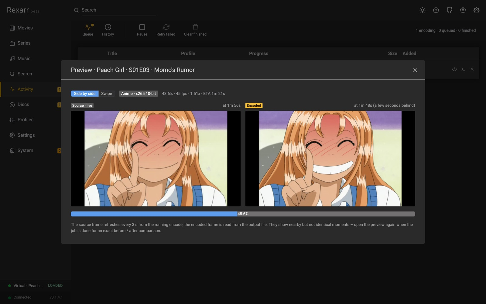<br>Live preview while encoding | 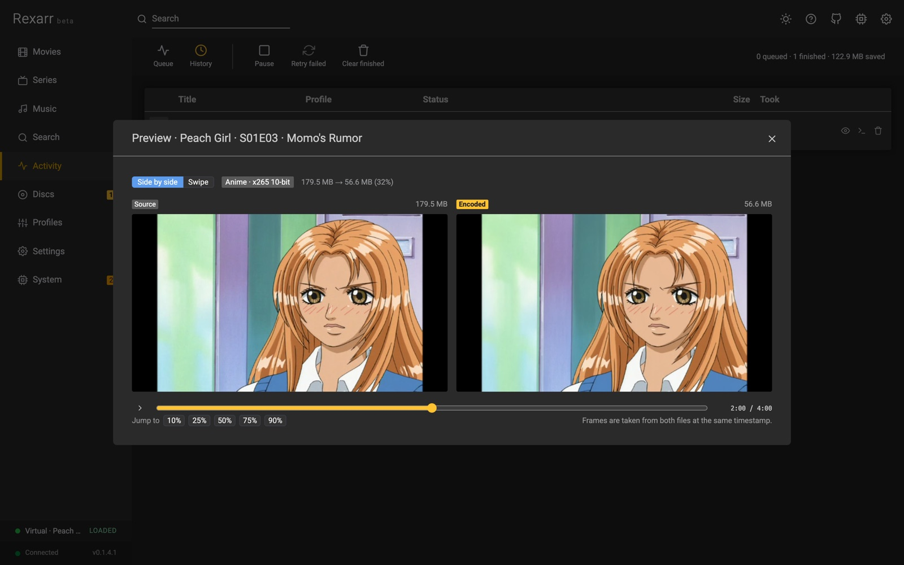<br>Before / after comparison of a finished encode |

In **Activity**, an encoding job's thumbnail becomes a live frame (refreshing every few seconds) and the eye button opens
the preview:

- **While encoding**: the current source frame, streamed from a small extra image output on the running ffmpeg process
  (no second decode), next to a frame read from the output file being written, a few seconds behind the encoder. MKV /
  WebM outputs only; MP4 / MOV cannot be read until the encode finishes. Profiles that copy video have no live frame.
- **When done**: an exact before / after comparison of source and encode at the same timestamp, side by side or as a
  **swipe** view with a draggable divider, with a timeline slider and jump buttons.
- API: `GET /api/jobs/:id/preview/live.jpg`, `/preview/encoded.jpg`, `/frame?which=source|output&t=&w=`. Preview files
  live in the Transcodes folder and are removed when the job ends.

## Auto transcode

Enable **Settings → Automation → Auto transcode new remuxes** and every Blu-ray remux that appears in Radarr or
Sonarr is queued automatically, with the profile for its type (movie, TV, or anime via Sonarr's series type or
AniDB). Per-type profiles can be overridden there; otherwise the default profiles are used.

- **Existing library**: by default the first scan only records the remuxes already present (a baseline) and
  transcodes new ones from then on. Tick *Also transcode remuxes already in the library* to work through the
  backlog, at most *Max new jobs per scan* at a time. **Preview** lists exactly what would be queued.
- **Schedule**: a scan runs every *Scan every (minutes)* (System → Tasks → *Auto transcode new remuxes*).
- **Instant**: add a Webhook connection in Radarr / Sonarr (Settings → Connect, *On Import* + *On Upgrade*) pointing
  at `http://rexarr:3939/api/webhook/radarr` or `/sonarr`; a scan runs 15 seconds after each import.
- **No loops**: every file Rexarr queued, and every file it wrote, is remembered by path in `data/auto.json`, so a
  transcode that Radarr / Sonarr re-import (still named REMUX) is never transcoded again. Files that are not visible
  to Rexarr are reported (fix the path mapping) and picked up once they are. *Reset history* forgets everything.
- Auto-created jobs carry an **Auto** label in Activity and are logged under System → Events.
- API: `GET /api/auto/status`, `POST /api/auto/scan[?dryRun=1]`, `POST /api/auto/reset`, `POST /api/webhook/:arr`.

## AniDB for anime

Enable **Settings → Metadata → AniDB for anime**. Rexarr downloads AniDB's title dump and the
[Anime-Lists](https://github.com/Anime-Lists/anime-lists) mapping (AniDB ↔ TVDB / TMDB / IMDb) – about 20 MB,
cached for a week, no API key. With it:

- **Anime movies are recognised** in Radarr (which has no anime type): an *Anime* filter and badge on Movies,
  and the anime profile is picked by default when transcoding them.
- **Series** get their AniDB ids, romaji and kanji titles; the *Anime* filter uses AniDB as well as Sonarr's
  series type, and both libraries can be sorted by **romaji title**.
- **Disc identification** searches AniDB first, so a Japanese or romaji disc label (`KEKKON_SURUTTE_HONTOU_DESUKA_D1`)
  resolves through the mapping to the right Sonarr series or Radarr movie, marks it anime and turns on absolute
  numbering.
- `GET /api/anidb/search?q=` exposes the title search; AniDB links appear in the detail headers.

## Disc ripping (automatic ripping machine)

| | |
| :---: | :---: |
| 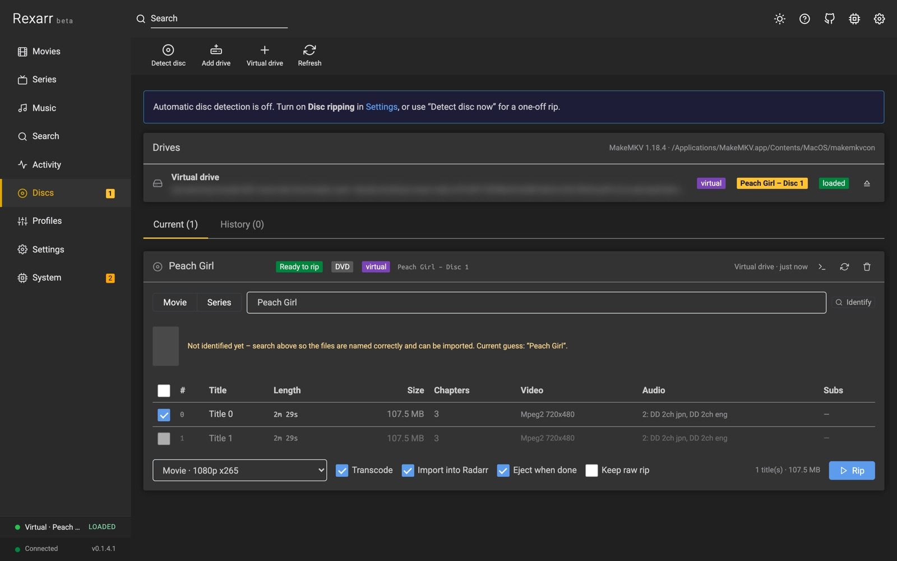<br>DVD scanned by MakeMKV, titles and tracks | 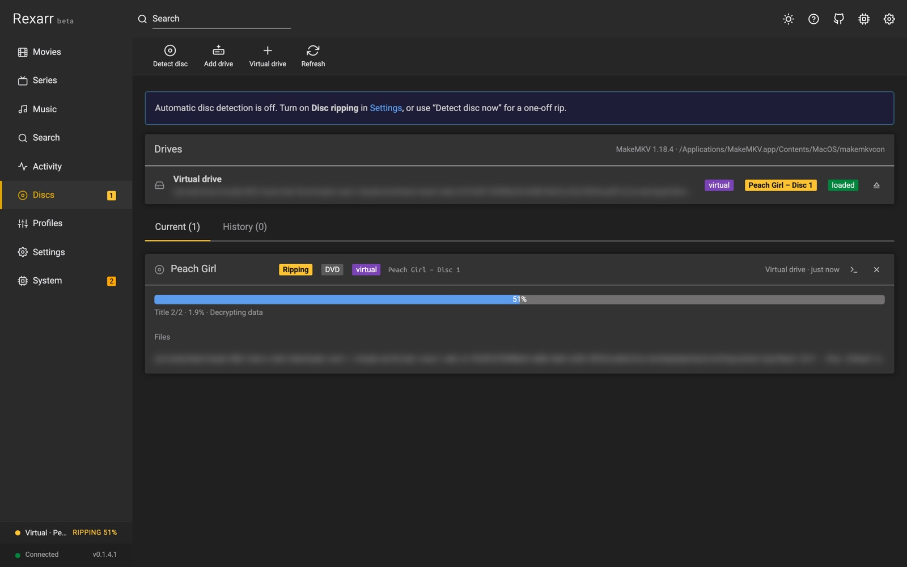<br>Ripping in progress |

Enable **Settings → Disc ripping** and Rexarr behaves like ARM:

1. Insert a Blu-ray / DVD. Rexarr polls the drives through `makemkvcon` and creates an entry on the **Discs** page.
2. The title list is read (titles shorter than *minimum title length* are skipped) and the disc label is looked
   up in Radarr (movies) and Sonarr (series). You can correct the match, pick season / first episode number, and
   choose which titles to rip.
3. MakeMKV rips each selected title to a remux MKV named so the \*arr apps parse it (`Title (Year) Remux-1080p.mkv`,
   `Show - S01E01 - Bluray-1080p Remux.mkv`).
4. Optionally the rips are queued for transcoding with a profile (the raw rip is removed afterwards unless *keep raw* is on).
5. The folder is handed to Radarr / Sonarr via `DownloadedMoviesScan` / `DownloadedEpisodesScan` (added to the
   library first if needed) and the disc is ejected.

**Drives MakeMKV does not list** (USB enclosures, a drive passed into Docker, one of several): *Discs → Add drive* and
enter the device path – `/dev/sr0`, `/dev/cdrom` or a stable `/dev/disk/by-id/…` path on Linux, `/dev/disk4` on macOS.
The dialog lists the optical devices it finds. Rexarr checks the tray itself (Linux `/sys/block/srN`, macOS `drutil`),
reads the label with `blkid` / `diskutil`, and rips through MakeMKV's `dev:` source. In Docker pass both nodes
(`--device /dev/sr0 --device /dev/sg0`); a configured drive that is missing shows up under System → Status.

With *auto rip* on, steps 2–5 run without confirmation. Requires [MakeMKV](https://www.makemkv.com/) (`makemkvcon`);
Rexarr auto-detects the macOS app bundle and `/usr/bin/makemkvcon`. Ejecting uses `drutil` on macOS and `eject` on Linux.

### Search

| | |
| :---: | :---: |
| 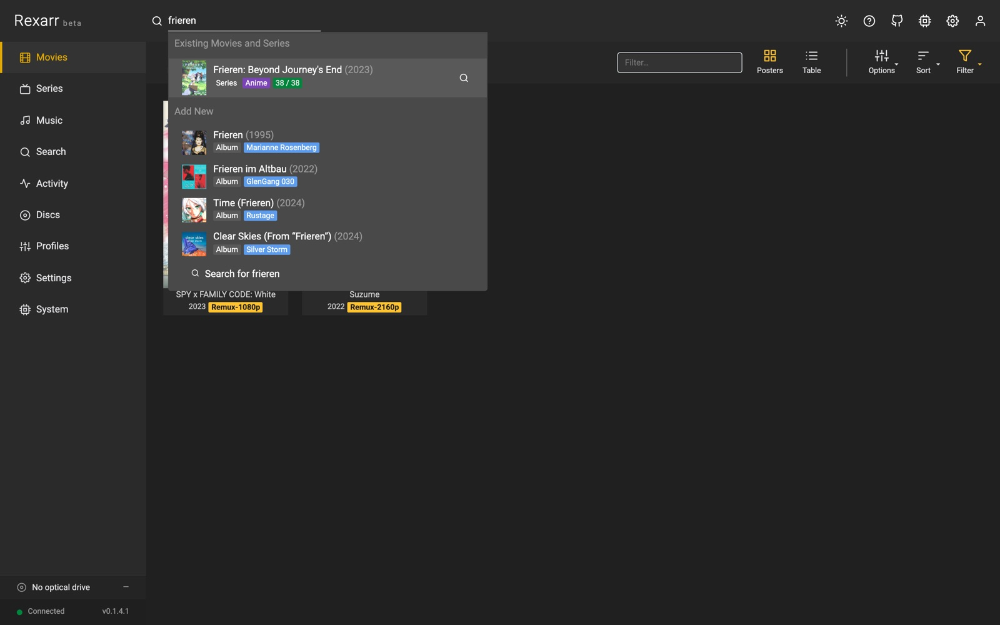<br>Header search | 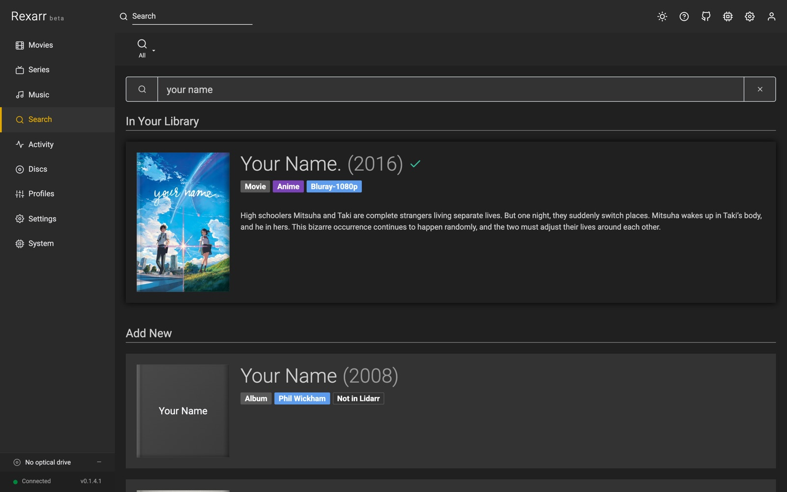<br>Search page |

Type a title in the header (`/`) or on the Search page; results appear as you type:

- **In your library** (instant): Radarr + Sonarr titles matched on title, alternate titles and AniDB romaji / kanji,
  typo-tolerant (`interstelar`, `spiderman`, `umaru`), with what is on disk (`Remux-2160p`, `12/24 · 6 remux`).
- **Add new**: TMDB / TVDB via Radarr / Sonarr lookup (ids go straight to `tmdb:` / `tvdb:` / `imdb:`), AniDB romaji
  names resolved to their TVDB / TMDB entry. *Add & search* adds the title (monitored, no automatic search).
- The query is parsed and shown as chips: year, movie / series, `S01E05` / `1x05` / `season 2` / `- 12`,
  `2160p` / `4k`, `remux` / `iso` / `bluray` / `web-dl`, `dv`, `hdr`, `atmos`, `x265`, `dual audio`. Opening a series
  pre-selects the season and episode.

Releases are classified (Remux › Disc / ISO › Blu-ray encode › WEB › HDTV / DVD), tagged (DV, HDR10+, Atmos, TrueHD,
DTS-HD MA, FLAC, HEVC, 10-bit, Dual audio…) and given a **smart score**: source quality and resolution first, then
what the search asked for (`2160p remux dv` boosts matching releases), lossless audio / HDR, seeders, Japanese or
dual audio for anime, and a penalty for rejected releases or ones naming another season. Filter by type and
resolution, filter the text (group, `Atmos`, `Japanese`), or sort by size / seeders / age. *Best* shows remux and
disc releases, falling back to everything, best source first, when there are none. Hover a score to see why.

### Full-disc releases from search

Search shows a **Remux / Remux + Disc / Disc / ISO / All** filter (the default follows *Settings → Defaults*).
Disc releases get a purple *Blu-ray ISO / disc*, *UHD Blu-ray* or *DVD* badge. Grabbing one:

1. Sends it to Radarr / Sonarr as usual and creates a job that follows the download in the app's queue
   (*Downloading full disc · 62%* in Activity).
2. When the download completes (Radarr / Sonarr cannot import it and leave it *import pending*), Rexarr maps the
   queue item's `outputPath` through the path mappings and looks for `.iso` / `.img` files and `BDMV` / `VIDEO_TS`
   folders up to three levels deep (samples skipped). Multi-disc packs become one rip per disc.
3. Each disc opens on the **Discs** page already matched to the movie / series, with the profile picked at grab time.
   Movies rip straight away; series wait for you to check the title → episode order (disc 2 starts after disc 1's
   episodes). Disc sets rip into `Show (Year) - Disc N` folders so parallel rips never mix files.
4. After transcoding the folder is imported with `DownloadedMoviesScan` / `DownloadedEpisodesScan`, and once the last
   disc is done the stuck download is removed from the \*arr queue (`removeFromClient=false`, so torrents keep seeding).

Requirements: MakeMKV (Blu-ray ISOs need a registered or beta key), a path mapping for the download client's folder
(e.g. `/downloads` → `/mnt/downloads`), and a rip folder the \*arr apps can reach. Prowlarr grabs are untracked; open
the finished ISO with **Discs → Virtual drive**. If Radarr imports an `.iso` itself, Rexarr rips that file instead.

## Music

| | |
| :---: | :---: |
| 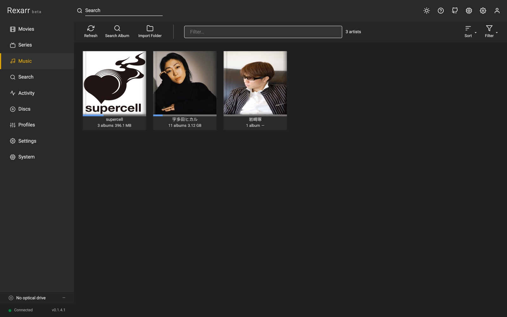<br>Artists | 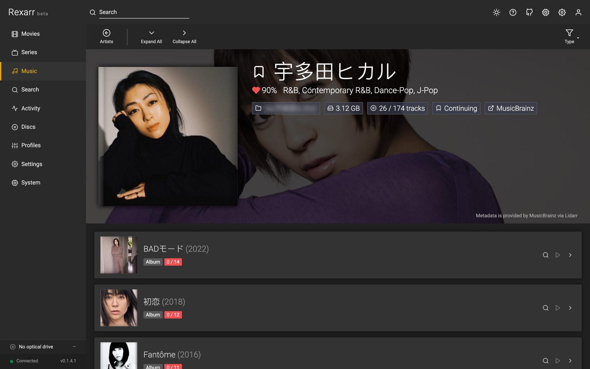<br>Artist and albums |

Connect **Lidarr** (API v1) in Settings → Connections to get a **Music** page and the *Music* scope in search.
Audio work runs through [fre:ac](https://www.freac.org/)'s command-line encoder `freaccmd`; FFmpeg is only used to
probe, resample and to write ReplayGain tags.

```
Search (Lidarr indexers + Soulseek)  →  Grab album
        ↓
Lidarr downloads it  /  slskd downloads the folder → Lidarr "import folder"
        ↓
Rexarr sees the imported track files  →  fre:ac with your music profile  →  Lidarr rescan
```

**Music profiles** (Profiles → *Music*): container / codec, VBR or CBR, compression level, maximum sample rate and
bit depth (FFmpeg soxr resampler with triangular dither when reducing), ReplayGain, embedded cover, and *Keep MQA
intact*. Built-ins: *Keep as downloaded*, *FLAC*, *FLAC CD quality (16-bit / 44.1 kHz)*, *WavPack*, *MP3 V0*,
*MP3 320*, *Opus 160* and *Vorbis q6*. Only open-source encoders are offered (no FDK-AAC, no Apple / Nero AAC);
old video profiles that used `libfdk_aac` fall back to FFmpeg's native AAC with a warning.

| Codec | fre:ac encoder | Tags / cover | ReplayGain |
| --- | --- | --- | --- |
| FLAC | `flac` (libFLAC, `-c 0…8`) | yes | yes |
| MP3 | `lame` (`-m VBR -q N` / `-m CBR -b N`) | yes (cover re-embedded by Rexarr) | yes |
| Opus | `opus` (`--bitrate`, `--comp`) | yes | yes (`R128`) |
| Vorbis | `vorbis` (`-q` / `-b`) | yes | – |
| WavPack | `wv` | yes | – |
| Monkey's Audio | `mac` | yes | – |

**Soulseek** (slskd): add the slskd URL and API key, the folder where slskd saves downloads, and add a Lidarr path
mapping if Lidarr sees that folder under another path. *Also search Soulseek* in album search groups peer responses
into album folders (one user + one directory) and shows format, bit depth, sample rate, track count, free slot
and queue length. Grabbing queues the folder in slskd; when every file has finished Rexarr asks Lidarr to import
the folder, then encodes with the profile. Folders from peers with a long queue can be hidden with *Max peer
queue*.

**Image + cue downloads**: Lidarr cannot import an album that is one long FLAC / APE / WavPack / WAV file with a
cue sheet. Rexarr watches Lidarr's queue (grabs from Lidarr itself included) and, when such a download finishes,
splits it into FLAC tracks with fre:ac inside the download folder (`rexarr-split/<album folder>`), keeping bit depth
and sample rate. Tracks get their tags from the cue sheet, plus album artist, disc number and the folder's cover
image. Cue sheets in Shift-JIS, GBK, Big5, EUC-KR or Windows-1252 are converted to UTF-8 first, and a FILE entry
that names the wrong file (`CDImage.wav` next to a `.flac`) is matched to the real one. Rexarr then asks Lidarr to
import the tracks for the same download, so the queue item completes. Soulseek folders are split the same way
before import. Search results show such releases as *image + cue*. Downloads that already left the queue can be
imported with Music → *Import Folder*. Turn it off in Settings → Connections → Lidarr.

**Audio CDs** (Discs → drive → ♫ *Read audio CD*): Rexarr reads the table of contents (macOS: the mounted
`.TOC.plist`; Linux: `cdparanoia -Q`), computes the MusicBrainz disc id and lists matching releases – pick one or
search by artist and album when the disc is not in MusicBrainz. Tracks are ripped by fre:ac with its paranoia
reader (`device://cdda:<drive>/<track>`) to FLAC, tagged (album, artist, track / disc numbers, date, label,
barcode, MusicBrainz ids), given the Cover Art Archive front cover, optionally encoded with a second music profile
and imported into Lidarr.

**MQA / MQA-CD**: lossless files and CD rips are scanned for the MQA sync word hidden in the lower bits of the
signal (L⊕R bit stream, 36-bit sync pattern, 4-bit original sample rate code). Detected albums get an *MQA* label
and `MQA` / `ORIGINALSAMPLERATE` tags. With *Keep MQA intact* a profile keeps such files bit-exact (FLAC at the source
bit depth and sample rate, no dither, no resampling) and skips lossy targets, since any of those destroy the MQA
stream. Detection is a best-effort signal check, not a licensed decoder – Rexarr never unfolds MQA.

**Metadata**: Music → album → a track's 👁 *Tags and file details* button shows every tag, stream and format detail Rexarr reads from the
file (the same view is available for any media file through `GET /api/media/metadata?path=`).

The Docker image includes Alpine's fre:ac 1.1.7, which has FLAC, LAME MP3, Opus and Vorbis but **no WavPack or
Monkey's Audio encoder** (profiles using them show a warning and their jobs fail). Outside Docker, install fre:ac and
set its path in Settings → Connections → fre:ac if it is not found; System → Status warns when it is missing.

## Local media (outside the \*arr apps)

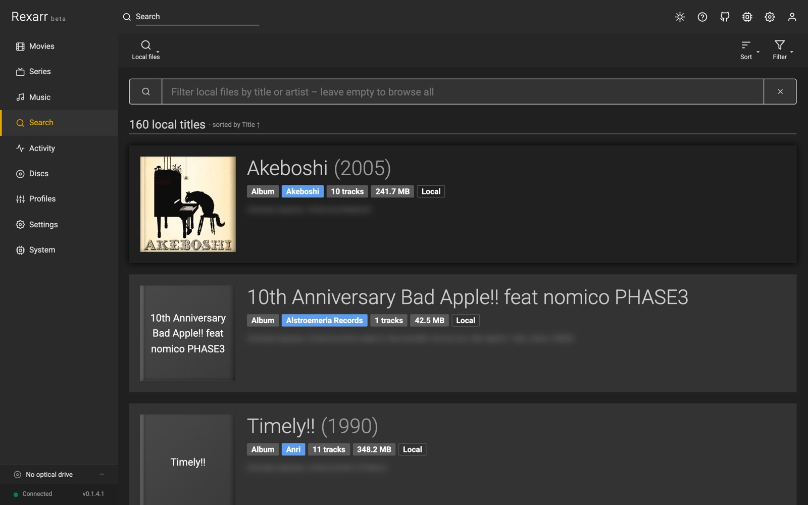

Not every movie, show or album is added to Radarr, Sonarr or Lidarr. Rexarr scans the local folder of every path
mapping (and any folders added in Settings → Connections → *Local media*) in the background and indexes what the
apps do not manage:

- **Movies**: `Title (Year)/…` folders or loose `Title.Year.2160p.Remux….mkv` files, with quality from the name
- **Series / anime**: `Show/Season 01/…S01E05…`, `1x05`, or `[Group] Show - 05` absolute numbering
- **Albums**: audio grouped per folder – `Artist/Album (Year)/01 - Track.flac`, `Artist - Album`, `CD1` / `CD2`

Folder names such as *Movies*, *TV Shows*, *Anime*, *Anime Movies* and *Music* are used as hints (or set a folder's
kind explicitly). Titles whose folder belongs to an \*arr app are hidden, samples / extras / NAS recycle bins / game
libraries are skipped, and posters (`poster.jpg`, `folder.jpg`, `cover.jpg`) are shown when present. Search (the
header popup and the Search page) lists matches under **On Disk, Not in \*arr**; a title's page lists its files,
encodes them with any profile, or looks the title up to add it to Radarr / Sonarr / Lidarr. The index lives in
`data/local-media.json` and refreshes every 12 hours (configurable), on saving new folders, or with *Rescan*.

## Design

The UI follows the \*arr frontend conventions so it feels like Sonarr / Radarr: a 60px header with global
search, a 210px sidebar with status messages, a 60px per-page toolbar with icon-over-label buttons and
sort / filter menus, `#202020` page body, `#333` cards, filled labels, 4px-radius buttons and inputs, poster
grids with episode progress bars, backdrop detail headers and season blocks. The colour tokens in
`client/src/styles.css` are named after Sonarr's theme variables (dark and light themes; toggle in the header)
with Radarr's yellow as the accent. The styles are Rexarr's own implementation of that look, not copied
source.

## Requirements

- Node.js 22.12+ (bundled in the release packages, except FreeBSD)
- FFmpeg 6+ (7.x recommended) with the encoders you plan to use
- MakeMKV (optional, for disc ripping)
- fre:ac 1.1.7+ (optional, for music encodes and CD rips; macOS: `brew install --cask freac`) and cdparanoia on
  Linux for CD tables of contents
- Lidarr v2 (API v1) and slskd (optional, for music)
- Radarr v4 / Sonarr v4 (API v3); Prowlarr optional

## Install from a release

Every [release](https://github.com/MoonlightLaboratory/rexarr/releases) has packages for each platform, named like
Sonarr's (`rexarr.main.<version>.<platform>`). Each one bundles Node.js; FFmpeg, fre:ac and MakeMKV are installed
separately (see *Requirements*).

| Platform | Package | How to run |
| --- | --- | --- |
| Windows 10 / 11 | `win-x64-installer.exe` (`win-x86-installer.exe` for 32-bit) | Run the installer, then **Rexarr** from the Start menu. Portable: `win-x64.zip`, run `rexarr.vbs` (no window) or `rexarr.cmd` (console) |
| macOS 11+ | `osx-arm64-app.zip` (Apple silicon), `osx-x64-app.zip` (Intel) | Unzip, move `Rexarr.app` to Applications and open it. Terminal: `osx-*.tar.gz`, run `rexarr/rexarr` |
| Linux (glibc: Debian, Ubuntu, Fedora…) | `linux-x64`, `linux-arm64`, `linux-arm` (32-bit Raspberry Pi OS) `.tar.gz` | `tar -xzf rexarr.main.*.tar.gz && ./rexarr/rexarr` |
| Linux (musl: Alpine) | `linux-musl-x64`, `linux-musl-arm64` `.tar.gz` | `apk add libstdc++`, then `./rexarr/rexarr` |
| FreeBSD | `freebsd-x64.tar.gz` (no bundled Node) | `pkg install node22`, then `./rexarr/rexarr` |

Then open **http://localhost:3939**. On first launch Rexarr opens **System → Tools**, which checks for FFmpeg, fre:ac,
MakeMKV and slskd and shows how to install whichever is missing on your platform (winget / Homebrew / apt commands
and the official download pages). The Windows installer has the same list as a *Recommended tools* page: tick a tool
and its download page opens when setup finishes. Notes:

- **Data** lives in `C:\ProgramData\rexarr` on Windows and `~/.config/rexarr` elsewhere (`REXARR_CONFIG_DIR`
  overrides it). Upgrading replaces the program files only.
- **Stopping**: *System → Shutdown*, or close the console / press Ctrl+C. Launching Rexarr again while it is running
  just opens it in your browser.
- **macOS**: the app is not notarised. If macOS says it cannot be opened, open it once from Finder with
  right-click → *Open*, or allow it under System Settings → Privacy & Security → *Open Anyway*.
- **Linux as a service** (systemd), with Rexarr extracted to `/opt/rexarr` and a `rexarr` user:

  ```ini
  # /etc/systemd/system/rexarr.service
  [Unit]
  Description=Rexarr
  After=network-online.target

  [Service]
  User=rexarr
  UMask=0002
  ExecStart=/opt/rexarr/rexarr
  Restart=on-failure
  TimeoutStopSec=20

  [Install]
  WantedBy=multi-user.target
  ```

  `sudo systemctl enable --now rexarr`; data then lives in `/home/rexarr/.config/rexarr` (or set
  `Environment=REXARR_CONFIG_DIR=/var/lib/rexarr`).

### Publishing a release (maintainers)

1. Set `APP_VERSION` in `shared/version.ts` and write `docs/release-notes/<version>.md`.
2. Push to `main`, then **Actions → Release → Run workflow** (or push a tag `v<version>`).
3. The workflow builds every package with `scripts/package.mjs`, builds the Windows installers with Inno Setup
   (`distribution/windows/rexarr.iss`), starts the packages on Linux x64 / arm64, Alpine, macOS and Windows
   (`scripts/smoke-test.sh`), then publishes the GitHub release and the `ghcr.io/moonlightlaboratory/rexarr:<version>`
   image. Pre-release is ticked by default while Rexarr is in beta.

Build packages locally with `npm run build && node scripts/package.mjs --targets osx-arm64-app,linux-x64` (Node
runtimes are downloaded from nodejs.org and checked against their SHA-256 sums; output in `release/`).

## Run from source

```bash
npm install
npm run build
npm start          # http://localhost:3939
```

Development (Vite dev server on :7979 proxying to the API on :3939):

```bash
npm run dev
```

Environment variables:

| Variable            | Default   | Description                          |
| ------------------- | --------- | ------------------------------------ |
| `REXARR_PORT`       | `3939`    | HTTP port                            |
| `REXARR_HOST`       | `0.0.0.0` | Bind address                         |
| `REXARR_CONFIG_DIR` | `./data`  | Root of everything Rexarr stores (`/config` in Docker); `REXARR_DATA_DIR` is accepted too |
| `REXARR_CLIENT_DIR` | auto      | Override location of the built UI    |
| `LOG_LEVEL`         | `info`    | Server log level                     |

### Storage layout

Everything lives under the config root and is listed with folder size and disk usage on **System → Status**:

| Path | Default | Override | Contents |
| --- | --- | --- | --- |
| Cache | `<config>/cache` | `REXARR_CACHE_DIR` | Regenerable data |
| Image Cache | `<config>/cache/images` | `REXARR_IMAGE_CACHE_DIR` | Posters and backdrops |
| Transcodes | `<config>/cache/transcodes` | `REXARR_TRANSCODE_DIR` | Encodes in progress, moved into place when finished |
| Disc Rips | `<config>/cache/rips` | `REXARR_RIP_DIR` (or Settings) | Raw MakeMKV output |
| Program Data | `<config>/data` | `REXARR_PROGRAM_DATA_DIR` | Settings, profiles, job / disc history, events |
| Metadata | `<config>/data/metadata` | `REXARR_METADATA_DIR` | AniDB datasets |
| Backups | `<config>/data/backups` | `REXARR_BACKUP_DIR` | Configuration backups |
| Logs | `<config>/log` | `REXARR_LOG_DIR` | `rexarr.txt` + rotated logs |

An older flat config folder is moved into this layout automatically on first start (logged under System → Events).
Encodes are written to **Transcodes** and moved next to their output when done; if that folder is on a small disk,
point `REXARR_TRANSCODE_DIR` at a big volume or choose *Settings → FFmpeg → Write encodes to → Next to the output file*.
When replacing an original, the finished encode is copied next to it before the original is deleted.

## Docker

Pre-built images are published to `ghcr.io/moonlightlaboratory/rexarr` (`latest`, branch and version tags,
linux/amd64 + linux/arm64) by the GitHub Actions workflow in `.github/workflows/docker.yml`.

```bash
docker compose up -d          # uses the published image
docker compose up -d --build  # or build locally from ./Dockerfile
```

- **Image**: Node 22 on Alpine with the distro ffmpeg (x264, x265, SVT-AV1, libaom, VP9, Opus), VAAPI drivers and
  fre:ac for music (about 530 MB). Multi-stage build; the runtime layer only carries the compiled server, the client
  bundle and production dependencies (about 45 MB of node modules). `--build-arg WITH_FREAC=0` leaves fre:ac out
  (about 90 MB smaller) if you do not use music.
- **Build it yourself**:

  ```bash
  docker build -t rexarr .
  docker run -d --name rexarr -p 3939:3939 -e PUID=1000 -e PGID=1000 \
    -v ./config:/config -v /path/to/media:/data/media rexarr
  ```

  For another architecture use `docker buildx build --platform linux/amd64,linux/arm64 …`; the JavaScript is built
  once on the host platform, only the runtime layer is per-architecture.
- **`PUID` / `PGID` / `UMASK`** work like the LinuxServer images: the entrypoint reuses or creates a user with
  those ids, chowns `/config`, opens passed-through `/dev/sr*` / `/dev/dri/*` nodes, then drops privileges.
- **`/config`** holds everything (see *Storage layout*: `cache/`, `data/`, `log/`). Mount it. To keep large
  in-progress encodes off the config disk, mount a volume at `/config/cache/transcodes` or set `REXARR_TRANSCODE_DIR`.
- **Media**: mount at the **same path Radarr / Sonarr see it** (for example `/data/media` in all three) and no
  path mapping is needed; otherwise add one under **Settings → Path mappings**. The health check on the
  **System** page tells you when a file the *arr app reports is not visible to rexarr.
- **Rips**: point *Settings → Disc ripping → Rip directory* at a roomy mounted volume (`/data/rips`).
- **Hardware encoding**: pass `/dev/dri` for Intel QuickSync / VAAPI (`LIBVA_DRIVER_NAME=iHD` is preset; the Intel
  drivers are included on amd64). AMD VAAPI needs mesa, which adds about 200 MB, so build with
  `--build-arg WITH_AMD_VAAPI=1` if you want it.
  NVENC needs an ffmpeg with CUDA support (mount one and point *Settings → FFmpeg* at it) plus the NVIDIA
  container runtime.
- **Disc ripping**: `makemkvcon` is not redistributable, so the default image cannot rip. Build
  `docker/Dockerfile.makemkv` yourself (it compiles MakeMKV OSS + bin from makemkv.com, accepting their EULA),
  pass `--device /dev/sr0 --device /dev/sg0`, and enter your MakeMKV key once. Alternatively run Rexarr on the
  host for ripping and in Docker for everything else.
- `HEALTHCHECK` hits `/api/health`; the server binds `0.0.0.0:3939`; `REXARR_PORT`, `REXARR_HOST`,
  `REXARR_DATA_DIR`, `LOG_LEVEL` are honoured.

The build stages (`npm ci` → `npm run build` → `npm prune --omit=dev` → copy `server/dist`, `client/dist`,
`shared`, `node_modules`) are exercised in the repo's own test bench; the pruned runtime tree boots and serves the UI.

## Setup

0. On first launch, **System → Tools** lists FFmpeg (required), fre:ac, MakeMKV and slskd with install steps for your
   platform. Close it with *Skip for now* / *Continue*; it stays available in the System menu
   (`GET /api/setup/tools`, `POST /api/setup/dismiss`).
1. Open **Settings**, enable Radarr and/or Sonarr, paste the URL and API key, click **Test**, save.
2. Check **System** – it lists the ffmpeg version and which encoders are actually available.
3. Pick default profiles per media type (movie / TV / anime) or create your own under **Profiles**.
4. **Search** for a title. If it is not in Radarr / Sonarr yet, Rexarr adds it. Choose a profile,
   click **Grab** on a remux. The job appears in **Activity** as *Waiting for import* and starts
   encoding once the \*arr app has imported the download.
5. Or go to **Movies** / **Series**, filter to *Remux only* and transcode files you already have.

## Settings → General

Laid out like Sonarr's General settings (*Show Advanced* reveals the orange, advanced fields):

- **Host** – Bind Address (`*`, `localhost` or an IP), Port, URL Base (reverse proxy sub-path, e.g. `/rexarr`),
  Instance Name (browser tab and login page), Application URL (used for webhook links), and SSL (HTTPS on its own
  port with a PEM cert + key or a `.pfx`). Host changes need a restart: the page shows a *Restart* button, and Rexarr
  restarts its web server in place (falling back to the old port if the new one cannot be bound).
  `REXARR_PORT` / `PORT`, `REXARR_HOST` and `REXARR_URL_BASE` environment variables take precedence and lock the fields.
- **Security** – Authentication *None*, *Basic (Browser Popup)* or *Forms (Login Page)*; *Authentication Required* can
  skip local addresses (a reverse proxy's `X-Forwarded-For` is honoured only when the proxy itself is local).
  Passwords are stored as salted scrypt hashes; sessions are signed cookies (30 days with *Remember me*); repeated
  failed logins are throttled and logged under System → Events. The **API key** (`X-Api-Key` header or `?apikey=`)
  always works – the webhook URLs on the Connections page include it when authentication is on. Locked out? Start
  Rexarr once with `REXARR_RESET_AUTH=1` to turn authentication off. *Certificate Validation* controls HTTPS checks for
  Radarr / Sonarr / Prowlarr and other servers (enabled, disabled for local addresses, disabled).
- **Proxy** – HTTP(S) proxy (with credentials, an ignore list such as `*.local, 192.168.1.*`, and a bypass for local
  addresses) for AniDB data, cover art and remote *arr apps.
- **Logging** – Info / Debug / Trace (Debug and Trace add every HTTP request) and the log file size before rotation.
- **Updates** – branch and mechanism (Docker: pull the new image; automatic updates are not available with Docker).
- **Backups** – folder (relative to the config directory), interval (1–7 days) and retention (scheduled backups older
  than this are removed, the newest three are always kept).

## Output names and metadata

An encoded remux is not a remux any more, so by default (profile → Output → *Rename for the encode*) the release
tokens in the file name are rewritten to describe the result. Radarr / Sonarr then report the real quality after
the rescan instead of Remux:

| Source | Encode (x265 10-bit, Opus) |
| --- | --- |
| `Blade Runner 2049 (2017) Remux-2160p.mkv` | `Blade Runner 2049 (2017) Bluray-2160p.mkv` (or `Bluray-1080p` when downscaled) |
| `Frieren - S01E05 - Phantoms of the Dead - Bluray-1080p Remux.mkv` | `Frieren - S01E05 - Phantoms of the Dead - Bluray-1080p.mkv` |
| `Movie.2017.2160p.UHD.BluRay.REMUX.DV.HDR.HEVC.TrueHD.Atmos.7.1-GRP.mkv` | `Movie.2017.2160p.UHD.BluRay.HDR.10bit.x265.Opus.7.1-GRP.mkv` |

Only quality, resolution, codec, audio, HDR (Dolby Vision is dropped by an encode, HDR10 kept) and bit-depth tokens
already in the name change; titles, years, ids and release groups stay. *Write clean metadata* sets the file title
(`Movie (Year)` / `Show - S01E05 - Title`), names tracks (`2160p HEVC 10-bit HDR10`, `English · Opus 5.1`, subtitle
language / Forced / SDH), marks the first audio track default, removes stale source stream tags and adds a comment
describing the encode. The profile editor's command preview shows the resulting file name.

## How a profile becomes an ffmpeg command

- Streams are selected explicitly by index from `ffprobe` output: one video stream, audio streams
  filtered by language (with commentary dropped), subtitles filtered by language / type, font
  attachments when the container is MKV.
- Quality is mapped per encoder family: `-crf` for x264 / x265 / SVT-AV1 / libaom / VP9, `-cq` +
  `-rc vbr` for NVENC, `-global_quality` for QuickSync, `-qp` for VAAPI / AMF, `-q:v` for
  VideoToolbox.
- HDR sources keep colour primaries / transfer / matrix flags and, for x265, mastering-display and
  content-light metadata. Dolby Vision RPU layers are dropped (HDR10 base layer kept) with a
  warning.
- MP4 / MOV get `-movflags +faststart`, `hvc1` tagging for HEVC, text subtitles as `mov_text`;
  bitmap subtitles and incompatible audio codecs are dropped / re-encoded with a warning in the log.
- Output goes to `<name>.<ext>` next to the source (or your directory / suffix), written as a
  `.rexarr-part` temp file and renamed on success. With *Replace original* the source is deleted
  and Radarr / Sonarr are asked to rescan.

## Test bench (transcoding + disc ripping without hardware)

```bash
npm run test-media          # writes ./test-media (gitignored)
```

This generates, with ffmpeg only:

| Path | What it is |
| --- | --- |
| `Movies/Test Movie (2024)/Test.Movie.2024.1080p.BluRay.REMUX.mkv` | 1080p h264, FLAC English + Japanese, SRT eng/jpn, chapters |
| `TV/Test Show/Season 01/… S01E01/E02 … Remux.mkv` | two "episodes" with the same layout |
| `hdr/Test.HDR.2160p.BluRay.REMUX.mkv` | 10-bit HEVC tagged BT.2020 / PQ with HDR10 metadata (needs libx265) |
| `discs/TEST_DVD.iso` + `discs/TEST_DVD_FOLDER/VIDEO_TS` | a real DVD-Video (two titles, two audio languages) – needs `dvdauthor` (`brew install dvdauthor` / `apt install dvdauthor`) |

**Transcoding**: queue any of the MKVs directly (`POST /api/jobs` with `source.localPath`, or add `test-media/Movies`
as a Radarr root folder and use the library pages). Every built-in profile has been run against these.

**Disc ripping**: set **Settings → Disc ripping → Virtual drives folder** to `test-media/discs`. Every `.iso` /
`.img` file and every DVD or Blu-ray folder (`VIDEO_TS`, `BDMV`) there appears on the **Discs** page as a loaded
*virtual* drive. Rexarr feeds it to the real `makemkvcon` through its `iso:` / `file:` sources, so scanning,
identification, ripping, transcoding and *arr delivery run exactly as with a physical disc; only eject is a no-op.
Or link images individually: **Discs → Virtual drive** adds an `.iso` / `.img` file or a `BDMV` / `VIDEO_TS`
folder (the folder itself or its parent) as a persistent virtual drive with an optional label. It shows next to the
real drives, is picked up by the poller like an inserted disc (so auto-rip works), and *eject* removes the link
without touching the file. "Rip once" in the same dialog rips an image without keeping it. API:
`GET/POST /api/disc/virtual`, `DELETE /api/disc/virtual/:id`, `POST /api/disc/open {"path"}`.
MakeMKV decrypts commercial DVDs on its own; Blu-ray images need a registered or current beta MakeMKV key.

## Tests

```bash
npm test
```

## License

Rexarr is licensed under the [GNU General Public License v3.0](../LICENSE.md). See [COPYRIGHT.md](../COPYRIGHT.md).
