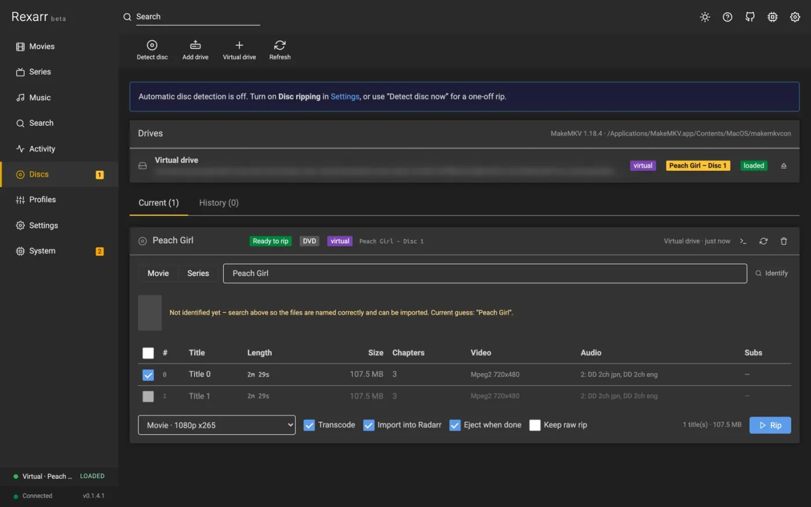
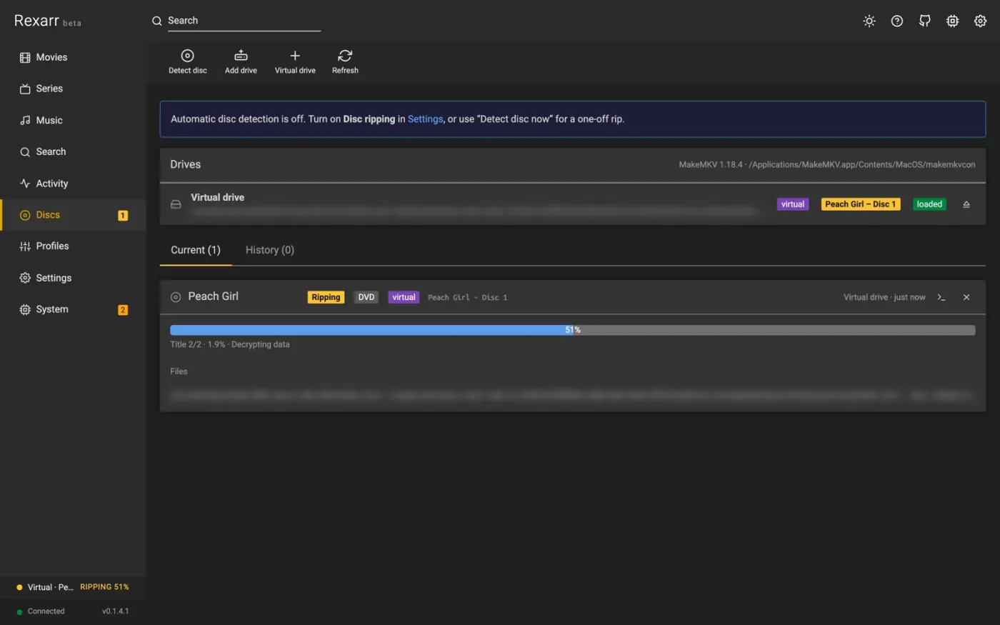

# Disc ripping

<div class="rx-shots" markdown>

<figure markdown>
{ decoding=async }
<figcaption>DVD scanned by MakeMKV, titles and tracks</figcaption>
</figure>

<figure markdown>
{ decoding=async }
<figcaption>Ripping in progress</figcaption>
</figure>

</div>

Rexarr behaves like an automatic ripping machine: insert a disc, it identifies it against your library, rips the
titles you want with MakeMKV, encodes them with a profile, and hands the finished files to Radarr / Sonarr —
checking that they really were imported. ([How it compares](../comparison.md) to ARM itself.)

**Settings → Disc ripping** is on by default. It does nothing until a disc is inserted, and it needs
[MakeMKV](https://www.makemkv.com/) (`makemkvcon`); Rexarr auto-detects the macOS app bundle and
`/usr/bin/makemkvcon`. In Docker, see [MakeMKV and Docker](makemkv-in-docker.md) — the published image does not
carry MakeMKV.

## The pipeline

1. **Detect** — Rexarr polls the drives through `makemkvcon` (every *Drive poll interval*) and creates an entry on
   the **Discs** page.
2. **Scan** — the title list is read. Titles shorter than *Minimum title length* are skipped unless
   [extras](#specials-and-extras) are included. Each title shows its length, size, audio tracks and subtitles, the
   estimated rip size and — when *Transcode* is on — the estimated size after encoding.
3. **Identify** — the disc label is matched against your library and, if needed, Radarr / Sonarr / AniDB lookups.
   You can correct the match, set season and first episode number, and choose which titles to rip.
4. **Rip** — MakeMKV rips each selected title **into Rexarr's local cache**, named so the \*arr apps parse it
   (`Title (Year) DVD.mkv`, `Show - S01E01 - Bluray-1080p Remux.mkv`).
5. **Encode** — optionally the rips are queued for transcoding with a profile, still in the cache (the raw rip is
   removed afterwards unless *Keep raw* is on).
6. **Move** — only finished files are moved to the **rip directory**, copied under a temporary name and renamed when
   complete, so a half-written file is never visible to anything else.
7. **Deliver** — the files are handed to Radarr / Sonarr by **Manual Import**, with the movie or the episodes
   stated, and every file is verified afterwards. The disc is ejected if *Eject when done* is on.

With *Start ripping automatically once identified* (auto rip) on, steps 3–7 run without confirmation.

!!! note "Why ripping happens in the cache"
    Raw MakeMKV output used to be written straight into the rip directory, so a rip that failed before encoding left
    uncompressed files there for the [rip-folder sweep](#importing-what-is-left-in-the-rip-folder) to import. Since
    0.1.6.0 nothing reaches the rip directory until it is finished.

## Drives

Rexarr lists the drives MakeMKV reports. For drives it does not list — USB enclosures, a drive passed into Docker,
one of several — use **Discs → Add drive** and enter the device path:

| Platform | Device path |
| --- | --- |
| Linux | `/dev/sr0`, `/dev/cdrom`, or a stable `/dev/disk/by-id/…` path |
| macOS | `/dev/disk4` |

The dialog lists the optical devices it finds. Rexarr then checks the tray itself (Linux `/sys/block/srN`, macOS
`drutil`), reads the label with `blkid` / `diskutil`, and rips through MakeMKV's `dev:` source. In Docker pass both
nodes (`--device /dev/sr0 --device /dev/sg0`). A configured drive that is missing shows up under **System → Status**.

Ejecting uses `drutil` on macOS and `eject` on Linux. One drive is checked at a time, and never while MakeMKV is
using a disc.

!!! tip "macOS mounts DVDs automatically"
    macOS mounts a DVD as soon as it is inserted, which leaves MakeMKV only its "OS access mode" — that fails on
    most discs. Rexarr unmounts the volume (the disc stays in the drive) before scanning and ripping.

### Virtual drives

A disc image behaves exactly like a disc:

- **Discs → Virtual drive** adds an `.iso` / `.img` file or a `BDMV` / `VIDEO_TS` folder (the folder itself or its
  parent) as a persistent virtual drive with an optional label. It shows next to the real drives, is picked up by
  the poller like an inserted disc (so auto rip works), and *eject* removes the link without touching the file.
  *Rip once* in the same dialog rips an image without keeping the link.
- **Settings → Disc ripping → Virtual drives folder** turns a whole folder of images into always-loaded virtual
  drives. Mainly a testing aid — see [Development](../development.md#test-bench).

MakeMKV decrypts commercial DVDs on its own; Blu-ray images need a registered or current beta MakeMKV key.

## Identifying the disc

Disc labels are terse (`SNAFU_2_DISC_1`, `NARUTO_S1_D2`, `MOVIE_DISC`). Rexarr:

1. matches the label against **your own library first** — Radarr and Sonarr titles, alternate titles and
   [AniDB](anidb.md)'s name for each season — so `SNAFU_2_DISC_1` becomes *My Teen Romantic Comedy SNAFU*, season 2
   ("SNAFU Too!");
2. reads a trailing number, `S2`, `II` or `2nd Season` as a **season**;
3. scores search results instead of taking the first hit;
4. ignores labels made only of generic words (`MOVIE_DISC`, `BONUS`, `DISC1`) rather than matching a library title
   by those words alone.

**Match again** re-runs identification on a disc that was matched wrongly, and you can always pick the title
yourself. For a series, set the **season** and the **first episode number**; absolute numbering is used for anime
when AniDB says so.

## Titles, episodes and order

Each title gets a role in the **Episode / extra** column:

- an **episode** of the season (numbers beyond the season's last episode are flagged *special or extra?*),
- a **special** from season 0 — listed when TVDB has specials for the show — imported by Sonarr as `S00Exx`,
- an **extra**: *OP*, *ED*, *Extra*, *OVA*, *Special*, a **custom** name, or the disc's own title name.

For a multi-disc set, disc 2 continues after disc 1's episodes; disc sets rip into `Show (Year) - Disc N` folders so
parallel rips never mix files.

### Specials and extras

Sonarr and Radarr only import episodes and movies, so extras go into an `Extras` folder next to the show or movie
(Plex, Jellyfin and Emby show them there), named like `My Teen Romantic Comedy SNAFU - S02 - OP.mkv`.

Short titles (a creditless OP / ED runs about 90 seconds) are skipped by the minimum title length. Tick
**Settings → Disc ripping → Include extras and specials** to list them too, down to *Shortest extra* (30 s by
default); they start out as extras, with 60–150 s titles guessed as OP then ED.

### Audio tracks

Discs often carry the same language several times — DTS 5.1, Dolby Digital 5.1 and a stereo track. **Best audio per
language** (the default, **Settings → Disc ripping**) keeps the best one per language: lossless first (TrueHD,
DTS-HD MA, LPCM, FLAC), then DTS over Dolby Digital, then more channels, then the higher bitrate; commentary tracks
are never the automatic pick.

Tick the tracks you want per title in the **Audio** column — several at once is fine — and *Apply to all titles*
copies that choice to every episode on the disc.

Tracks that are not kept are dropped from the ripped MKV by a stream copy (no re-encode), which also shrinks the
file before it is transcoded: on a Naruto DVD, 6 audio tracks down to 1 took a title from 1.58 GB to 1.21 GB.

## Adding missing shows and movies

Some discs are for titles you have not added yet. With **Add shows and movies to Sonarr / Radarr when their disc
starts ripping** (on by default) Rexarr adds them — or do it before ripping with **Add to Sonarr now** on the Discs
page, which also lets you pick episodes by name.

- The title goes into the **root folder and quality profile your library already uses for that kind of title** —
  TV, anime, movies, anime movies — worked out from where your existing titles live and which profile most of them
  use. Folders that look like staging areas (`downloads`, `temp`, `incomplete`, `rips`) are never chosen.
- Override any of them under **Settings → Disc ripping → Where added titles go**.
- Added titles are **not monitored** by default, so adding a show to import one disc never starts downloading the
  rest of the season. Tick *Monitor what was added* if you do want Sonarr / Radarr to fill in the gaps and upgrade
  the rip.

## Delivery and import

The rip directory must be reachable by Radarr / Sonarr. **Settings → Disc ripping → Check import access** asks both
apps — through their own file browser, with your [path mappings](../reference/settings.md#path-mappings) applied —
whether they can see it, so a rip that cannot be imported is caught before the first disc.

When a rip finishes, Rexarr:

1. checks the folder is visible to the app as it will be sent (after path mappings);
2. sends a **Manual Import** stating the movie, or each episode, with DVD rips imported as DVD quality;
3. waits for the import command and then **verifies** it: the file has to be gone from the rip folder *and* the
   movie / episodes have to have a file in Radarr / Sonarr;
4. writes the result for every file into the disc log.

!!! warning "A command that completed does not mean a file was imported"
    Radarr and Sonarr report their import commands as `completed` even when they imported nothing. If nothing was
    imported — or only some of the files were — the rip **fails** with what happened, both paths and where the files
    are, instead of reporting success. The ripped files are kept.

    ```
    status: failed
    error:  Radarr cannot see /nonexistent/rips/Dune (2021) (this computer:
            /Volumes/Media/Rips/Dune (2021)) – fix the rip directory or its path
            mapping. The files are there and can be imported from
            Settings → Disc ripping.
    ```

    Fix the mapping and the files can still be imported — the rip then goes back to *done*.

### Importing what is left in the rip folder

**Import finished rips automatically** (on by default) hands anything still sitting in the rip folder to Radarr and
Sonarr every 10 minutes — a failed import, files you copied there by hand. **Import rip folder now** (Settings →
Disc ripping) does it immediately and lists what happened to each file. Folders are only touched once they have
stopped changing, and empty folders are tidied up afterwards.

!!! danger "Do not make the rip folder a root folder"
    If the rip directory is also a Radarr / Sonarr **root folder**, the app can take ownership of files there, and
    with its recycle bin off a replaced file is deleted permanently. Keep rips in their own folder outside your
    library roots.

## Keeping the computer awake

Ripping and encoding a disc takes hours, and a laptop or PC that sleeps in the middle of it leaves a broken file.
With **Keep this computer awake while ripping or encoding** (Settings → Encoding, on by default) Rexarr holds a
sleep inhibitor for as long as a scan, rip or encode is running, and releases it when nothing is:

| Platform | How |
| --- | --- |
| macOS | `caffeinate -i -s -m -w <pid>` |
| Windows | `SetThreadExecutionState(ES_CONTINUOUS \| ES_SYSTEM_REQUIRED)` from a hidden PowerShell process watching Rexarr |
| Linux | `systemd-inhibit` (`idle:sleep:shutdown`) |
| Docker | not attempted — the host's power settings decide |

The display is allowed to sleep; only the machine is kept awake. **System → Status** shows whether an inhibitor is
held and why.

## Full-disc releases from search

Search shows a **Remux / Remux + Disc / Disc / ISO / All** filter (the default follows *Settings → Encoding →
Defaults*). Disc releases get a purple *Blu-ray ISO / disc*, *UHD Blu-ray* or *DVD* badge. Grabbing one:

1. sends it to Radarr / Sonarr as usual and creates a job that follows the download in the app's queue
   (*Downloading full disc · 62%* in Activity);
2. when the download completes (Radarr / Sonarr cannot import it and leave it *import pending*), Rexarr maps the
   queue item's `outputPath` through the path mappings and looks for `.iso` / `.img` files and `BDMV` / `VIDEO_TS`
   folders up to three levels deep (samples skipped). Multi-disc packs become one rip per disc;
3. each disc opens on the **Discs** page already matched to the movie / series, with the profile picked at grab
   time. Movies rip straight away; series wait for you to check the title → episode order;
4. after transcoding the files are imported as above, and once the last disc is done the stuck download is removed
   from the \*arr queue (`removeFromClient=false`, so torrents keep seeding).

Requirements: MakeMKV (Blu-ray ISOs need a registered or beta key), a path mapping for the download client's folder
(for example `/downloads` → `/mnt/downloads`), and a rip folder the \*arr apps can reach. Prowlarr grabs are
untracked — open the finished ISO with **Discs → Virtual drive**. If Radarr imports an `.iso` itself, Rexarr rips
that file instead.

## Audio CDs

**Discs → drive → ♫ Read audio CD** rips music CDs with fre:ac instead of MakeMKV, with MusicBrainz metadata and
cover art. See [Music → Audio CDs](music.md#audio-cds).

## Troubleshooting

| Symptom | Cause and fix |
| --- | --- |
| *No titles found on this disc* in a second | The disc was mounted by the OS, or MakeMKV cannot decrypt it. Rexarr unmounts on macOS; check the MakeMKV key for Blu-ray |
| Nothing is imported, rip says *cannot see …* | The rip directory is not visible to the app at that path — fix **Settings → Path mappings** or the rip directory, then *Import rip folder now* |
| Some files imported, others not | The error names each file; usually a rejection (sample, unknown episode) — the disc log has the app's own reason |
| Episodes land on the wrong numbers | Set season and first episode before ripping; check the title order in the Episode column |
| A title is missing from the list | It is shorter than *Minimum title length* — lower it or tick *Include extras and specials* |
| Titles change number between scan and rip | Scan and rip use the same minimum length; if you changed it, scan again |
| Drive is not listed | **Discs → Add drive** with the device path; in Docker pass `/dev/sr0` **and** `/dev/sg0` |
| MakeMKV is missing or will not start | **System → Status** says why (wrong architecture, not executable, not found) |
