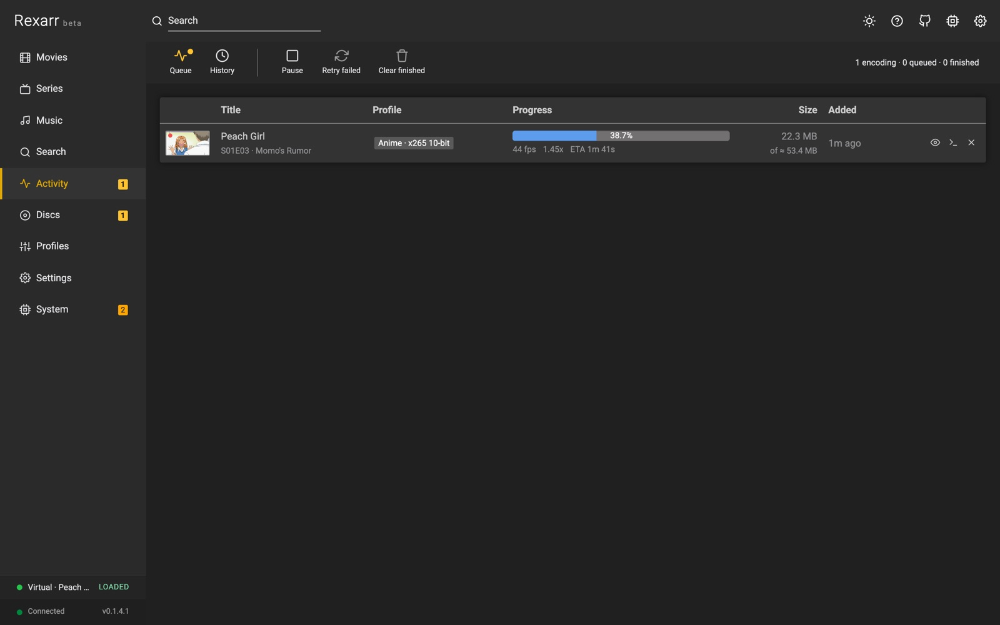

# Library

**Movies** and **Series** mirror what Radarr and Sonarr have, with what is actually on disk: file quality, size,
video and audio codecs, and how many episodes of a season are present.

- **Posters** or **Table** view, **Sort** (title, year, size, added, and romaji title when
  [AniDB](anidb.md) is on) and **Filter** — including *Blu-ray remux on disk* for movies and *Episodes on disk* for
  series, plus an *Anime* filter.
- **Select** turns on multi-select: tick posters (or *Select all*) and transcode everything selected with one
  profile. On a series page you can transcode a whole season the same way.
- **Refresh** re-reads the library from the \*arr app.
- A title's page shows the backdrop header, the files it has, and per-file actions: transcode with a profile, look
  at [tags and stream details](music.md#metadata), or search for a remux (**Search remux**, and
  **Search remux for this season** on a season block).
- Titles that are missing, or already queued, are marked (*Missing*, *In queue*).

## Activity

Everything Rexarr is doing, newest first:

- **Queue** — encodes running and waiting. *Encodes at a time* can be changed right here, the queue can be paused
  and resumed, and waiting jobs can be reordered.
- **Job states** — *Waiting for import* (the \*arr app is still downloading / importing), *Downloading full disc*
  with the download's own percentage, *Ripping*, *Encoding* with percent, fps, speed and ETA, then *Done* or
  *Failed*.
- **Labels** — *Auto* for jobs created by [auto transcode](auto-transcode.md), *Disc* for jobs from a
  [rip](disc-ripping.md).
- **Log** — the full ffmpeg command and output per job, kept after the job ends.
- **Preview** — a live frame while encoding and a before / after comparison when it is done. See
  [Encode preview](transcoding.md#encode-preview).
- **Retry** a failed job (or *Retry failed* for all of them), cancel a running one, clear finished ones.

Job history, events and the rest of the server's own activity live under **System** — see
[System and maintenance](../reference/system.md).
