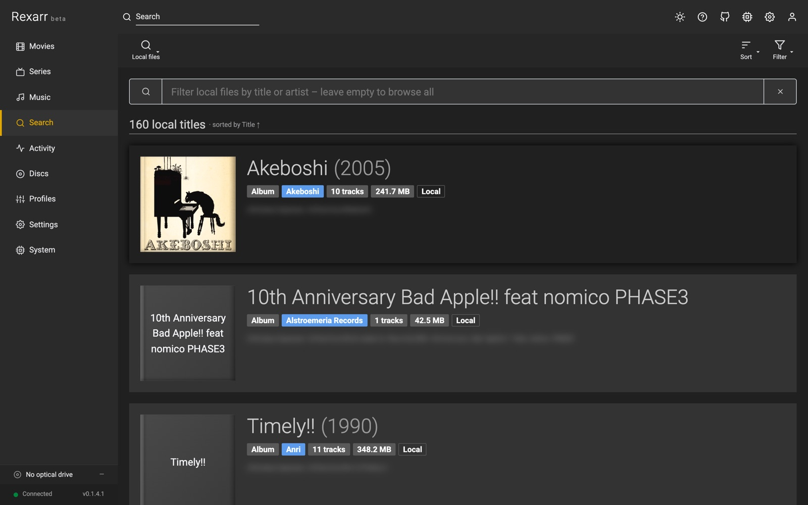

# Local media

Not every movie, show or album is added to Radarr, Sonarr or Lidarr. Rexarr scans the local folder of every path
mapping (and any folders added in **Settings → Connections → Local media**) in the background and indexes what the
apps do not manage:

- **Movies**: `Title (Year)/…` folders or loose `Title.Year.2160p.Remux….mkv` files, with quality from the name
- **Series / anime**: `Show/Season 01/…S01E05…`, `1x05`, or `[Group] Show - 05` absolute numbering
- **Albums**: audio grouped per folder — `Artist/Album (Year)/01 - Track.flac`, `Artist - Album`, `CD1` / `CD2`

Folder names such as *Movies*, *TV Shows*, *Anime*, *Anime Movies* and *Music* are used as hints (or set a folder's
kind explicitly). Titles whose folder belongs to an \*arr app are hidden, samples / extras / NAS recycle bins / game
libraries are skipped, and posters (`poster.jpg`, `folder.jpg`, `cover.jpg`) are shown when present.

Search — the header popup and the Search page — lists matches under **On Disk, Not in \*arr**. A title's page lists
its files, encodes them with any profile, or looks the title up to add it to Radarr / Sonarr / Lidarr.

The index lives in `data/local-media.json` and refreshes every 12 hours (configurable), when you save new folders,
or with **Rescan**. *Metadata* matches titles that have no metadata yet against TMDB / TVDB through the \*arr apps.

API: `GET /api/local/status`, `POST /api/local/scan`, `GET /api/local/items`, `GET /api/local/items/:id`,
`GET /api/local/items/:id/candidates`, `POST /api/local/items/:id/match`, `POST /api/local/metadata/refresh`.
