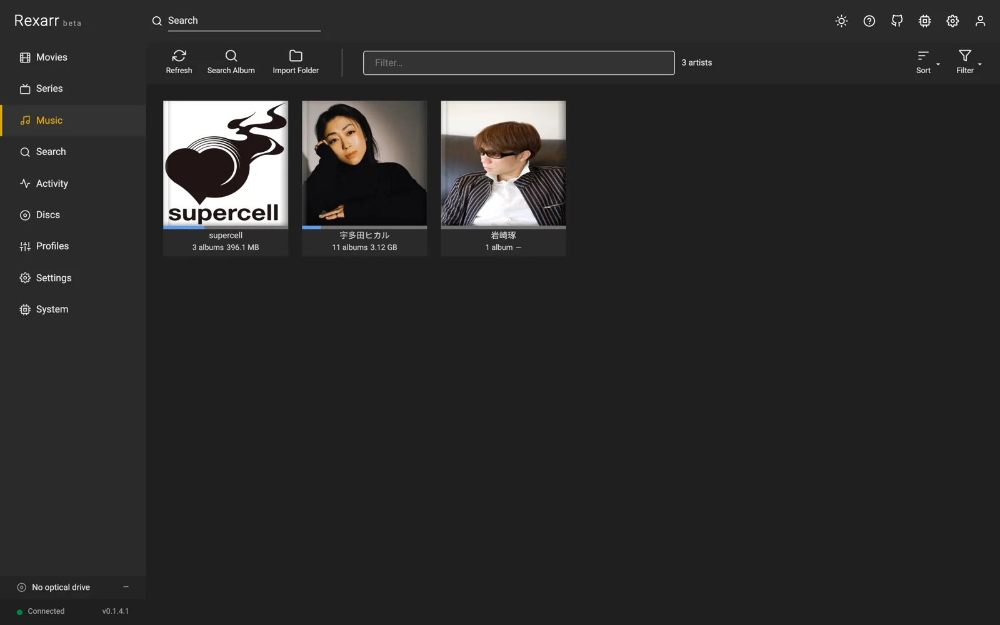
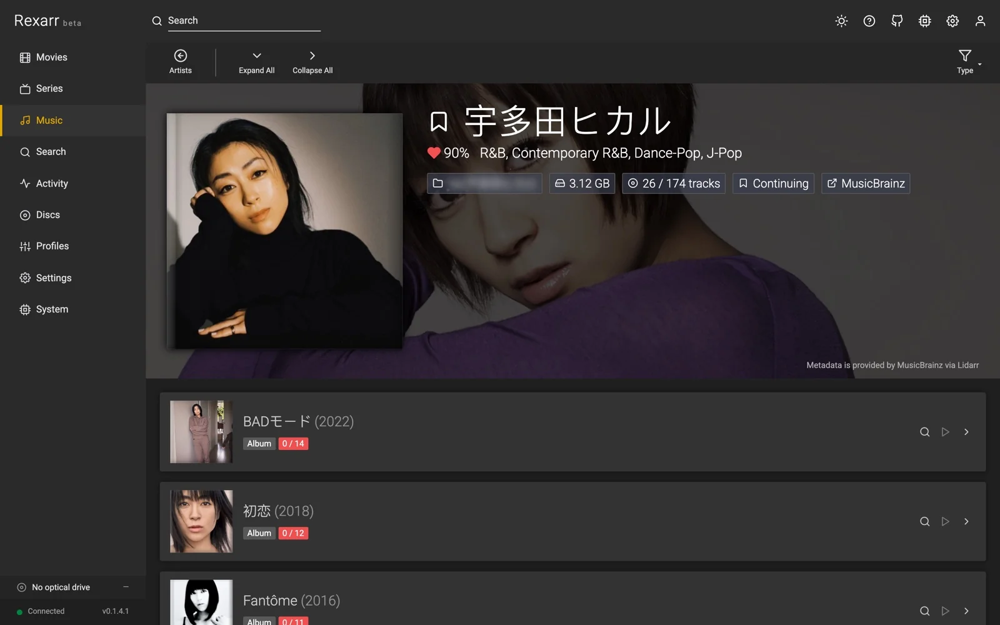

# Music

<div class="rx-shots" markdown>

<figure markdown>

<figcaption>Artists</figcaption>
</figure>

<figure markdown>
{ loading=lazy }
<figcaption>Artist and albums</figcaption>
</figure>

</div>

Connect **Lidarr** (API v1) in **Settings → Connections** to get a **Music** page and the *Music* scope in search.
Audio work runs through [fre:ac](https://www.freac.org/)'s command-line encoder `freaccmd`; FFmpeg is only used to
probe, resample and to write ReplayGain tags.

```
Search (Lidarr indexers + Soulseek)  →  Grab album
        ↓
Lidarr downloads it  /  slskd downloads the folder → Lidarr "import folder"
        ↓
Rexarr sees the imported track files  →  fre:ac with your music profile  →  Lidarr rescan
```

## Music profiles

**Profiles → Music**: container / codec, VBR or CBR, compression level, maximum sample rate and bit depth (FFmpeg
soxr resampler with triangular dither when reducing), ReplayGain, embedded cover, and *Keep MQA intact*.

Built-ins: *Keep as downloaded*, *FLAC*, *FLAC CD quality (16-bit / 44.1 kHz)*, *WavPack*, *MP3 V0*, *MP3 320*,
*Opus 160* and *Vorbis q6*. Only open-source encoders are offered (no FDK-AAC, no Apple / Nero AAC); old video
profiles that used `libfdk_aac` fall back to FFmpeg's native AAC with a warning.

| Codec | fre:ac encoder | Tags / cover | ReplayGain |
| --- | --- | --- | --- |
| FLAC | `flac` (libFLAC, `-c 0…8`) | yes | yes |
| MP3 | `lame` (`-m VBR -q N` / `-m CBR -b N`) | yes (cover re-embedded by Rexarr) | yes |
| Opus | `opus` (`--bitrate`, `--comp`) | yes | yes (`R128`) |
| Vorbis | `vorbis` (`-q` / `-b`) | yes | – |
| WavPack | `wv` | yes | – |
| Monkey's Audio | `mac` | yes | – |

The Docker image includes Alpine's fre:ac 1.1.7, which has FLAC, LAME MP3, Opus and Vorbis but **no WavPack or
Monkey's Audio encoder** (profiles using them show a warning and their jobs fail). Outside Docker, install fre:ac
and set its path in **Settings → Connections → fre:ac** if it is not found; **System → Status** warns when it is
missing.

## Soulseek (slskd)

Add the slskd URL and API key, the folder where slskd saves downloads, and a Lidarr path mapping if Lidarr sees that
folder under another path.

*Also search Soulseek* in album search groups peer responses into album folders (one user + one directory) and shows
format, bit depth, sample rate, track count, free slot and queue length. Grabbing queues the folder in slskd; when
every file has finished, Rexarr asks Lidarr to import the folder, then encodes with the profile. Folders from peers
with a long queue can be hidden with *Max peer queue*.

## Image + cue downloads

Lidarr cannot import an album that is one long FLAC / APE / WavPack / WAV file with a cue sheet. Rexarr watches
Lidarr's queue (grabs from Lidarr itself included) and, when such a download finishes, splits it into FLAC tracks
with fre:ac inside the download folder (`rexarr-split/<album folder>`), keeping bit depth and sample rate.

- Tracks get their tags from the cue sheet, plus album artist, disc number and the folder's cover image.
- Cue sheets in Shift-JIS, GBK, Big5, EUC-KR or Windows-1252 are converted to UTF-8 first.
- A `FILE` entry that names the wrong file (`CDImage.wav` next to a `.flac`) is matched to the real one.
- Rexarr then asks Lidarr to import the tracks for the same download, so the queue item completes.
- Soulseek folders are split the same way before import. Search results show such releases as *image + cue*.
- Downloads that already left the queue can be imported with **Music → Import Folder**.

Turn it off in **Settings → Connections → Lidarr**.

## Audio CDs

**Discs → drive → ♫ Read audio CD**: Rexarr reads the table of contents (macOS: the mounted `.TOC.plist`; Linux:
`cdparanoia -Q`), computes the MusicBrainz disc id and lists matching releases — pick one, or search by artist and
album when the disc is not in MusicBrainz.

Tracks are ripped by fre:ac with its paranoia reader (`device://cdda:<drive>/<track>`) to FLAC, tagged (album,
artist, track / disc numbers, date, label, barcode, MusicBrainz ids), given the Cover Art Archive front cover,
optionally encoded with a second music profile and imported into Lidarr. FLAC compression level and the Linux TOC
reader are set under **Settings → Disc ripping → Audio CDs**.

## MQA / MQA-CD

Lossless files and CD rips are scanned for the MQA sync word hidden in the lower bits of the signal (L⊕R bit stream,
36-bit sync pattern, 4-bit original sample rate code). Detected albums get an *MQA* label and `MQA` /
`ORIGINALSAMPLERATE` tags.

With *Keep MQA intact* a profile keeps such files bit-exact (FLAC at the source bit depth and sample rate, no
dither, no resampling) and skips lossy targets, since any of those destroy the MQA stream. Detection is a
best-effort signal check, not a licensed decoder — Rexarr never unfolds MQA.

## Metadata

**Music → album → a track's 👁 Tags and file details** shows every tag, stream and format detail Rexarr reads from
the file. The same view is available for any media file through `GET /api/media/metadata?path=`.
