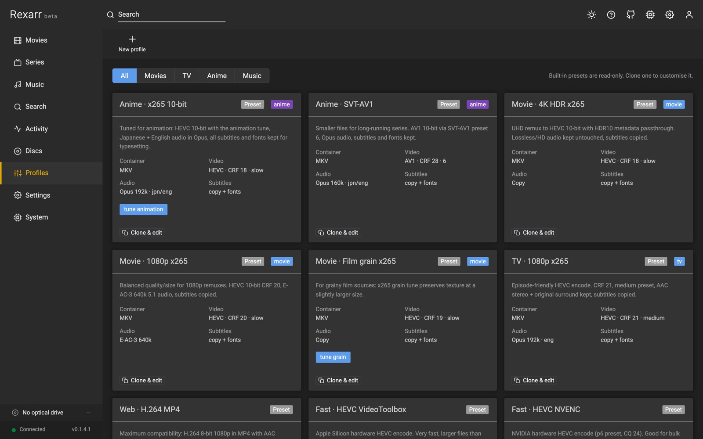

# Profiles

A profile is a complete description of one encode: container, video, audio, subtitles and output handling. Every job
uses exactly one profile. The built-in presets cannot be edited — **clone** one and change the copy.

## Video

| Field | What it does |
| --- | --- |
| **Encoder** | x264, x265, SVT-AV1, libaom-AV1, VP9, NVENC / QuickSync / VAAPI / AMF / VideoToolbox / RKMPP / V4L2 variants, or **copy** (no video re-encode) |
| **Quality** | CRF for x264 / x265 / SVT-AV1 / libaom / VP9; translated to CQ, QP, `global_quality` or `-q:v` for hardware encoders |
| **Preset** | Software: `ultrafast`…`placebo` (x264 / x265) or `0`–`13` (SVT-AV1). Hardware: `p1`–`p7` / speed levels |
| **Tune** | none, animation, film, grain, fastdecode, zerolatency |
| **Pixel format** | auto, `yuv420p` (8-bit), `yuv420p10le` / `p010le` (10-bit), `nv12` |
| **Max height** | downscale so the height fits (0 keeps the source resolution) |
| **HDR passthrough** | keep HDR10 colour metadata when the source is HDR |
| **Bitrate** | kbps, for encoders and modes that are bitrate-based (0 = quality based) |
| **Extra args** | raw ffmpeg arguments appended after the video options |
| **Software only (CPU)** | ignore the hardware acceleration set in Settings for this profile |

## Audio

| Field | What it does |
| --- | --- |
| **Encoder** | copy, AAC, Opus, E-AC-3, AC-3, FLAC, TrueHD (plus LAME MP3, Vorbis, WavPack, Monkey's Audio for music profiles) |
| **Bitrate / channels** | kbps per stream; channels 0 (keep), 2, 6 or 8 |
| **Languages** | ISO 639-2 codes to keep, e.g. `jpn`, `eng`. Empty keeps all |
| **First match only** | keep only the first stream per language |
| **Drop commentary** | skip tracks whose title says commentary |

Music profiles add VBR quality, maximum sample rate, bit depth, FLAC compression level, ReplayGain, embedded cover
and *Keep MQA intact* — see [Music](music.md).

## Subtitles

**Copy** everything, **copy text only**, **burn in** (choose the language, optionally preferring forced tracks), or
**none**. *Keep fonts* copies MKV font attachments, which anime subtitles need.

## Output

| Field | What it does |
| --- | --- |
| **Directory** | empty = next to the source file |
| **Suffix** | appended to the file name before the extension |
| **Replace original** | delete the source after a successful encode |
| **Rescan in \*arr** | ask Radarr / Sonarr to rescan when the encode finishes |
| **Rename for the encode** | rewrite release tokens in the name so it no longer claims to be a remux |
| **Write clean metadata** | file title, track titles, default track, no stale source tags |

## Built-in presets

| Video | Music |
| --- | --- |
| Anime · x265 10-bit | Music · Keep as downloaded |
| Anime · SVT-AV1 | Music · FLAC (lossless, keeps MQA) |
| Movie · 4K HDR x265 | Music · FLAC 16/44.1 (CD quality) |
| Movie · 1080p x265 | Music · WavPack (lossless) |
| Movie · Film grain x265 | Music · MP3 V0 (LAME) |
| TV · 1080p x265 | Music · MP3 320 (LAME) |
| Web · H.264 MP4 | Music · Opus 160k |
| Fast · HEVC VideoToolbox | Music · Ogg Vorbis q6 |
| Fast · HEVC NVENC | |
| Remux · Keep video, Opus audio | |

Only open-source audio encoders are offered (no FDK-AAC, no Apple / Nero AAC); old profiles that used `libfdk_aac`
fall back to FFmpeg's native AAC with a warning.

## Command preview

The profile editor shows the exact ffmpeg command the profile produces, either against a sample UHD remux or against
a real file on disk, together with the output file name it would write. Use it before you run a 4-hour encode.

## Output names and metadata

An encoded remux is not a remux any more, so by default (profile → Output → *Rename for the encode*) the release
tokens in the file name are rewritten to describe the result. Radarr / Sonarr then report the real quality after the
rescan instead of Remux:

| Source | Encode (x265 10-bit, Opus) |
| --- | --- |
| `Blade Runner 2049 (2017) Remux-2160p.mkv` | `Blade Runner 2049 (2017) Bluray-2160p.mkv` (or `Bluray-1080p` when downscaled) |
| `Frieren - S01E05 - Phantoms of the Dead - Bluray-1080p Remux.mkv` | `Frieren - S01E05 - Phantoms of the Dead - Bluray-1080p.mkv` |
| `Movie.2017.2160p.UHD.BluRay.REMUX.DV.HDR.HEVC.TrueHD.Atmos.7.1-GRP.mkv` | `Movie.2017.2160p.UHD.BluRay.HDR.10bit.x265.Opus.7.1-GRP.mkv` |

Only quality, resolution, codec, audio, HDR (Dolby Vision is dropped by an encode, HDR10 kept) and bit-depth tokens
already in the name change; titles, years, ids and release groups stay.

*Write clean metadata* sets the file title (`Movie (Year)` / `Show - S01E05 - Title`), names tracks
(`2160p HEVC 10-bit HDR10`, `English · Opus 5.1`, subtitle language / Forced / SDH), marks the first audio track
default, removes stale source stream tags and adds a comment describing the encode.

## How a profile becomes an ffmpeg command

- Streams are selected explicitly by index from `ffprobe` output: one video stream, audio streams filtered by
  language (with commentary dropped), subtitles filtered by language / type, font attachments when the container is
  MKV.
- Quality is mapped per encoder family: `-crf` for x264 / x265 / SVT-AV1 / libaom / VP9, `-cq` + `-rc vbr` for
  NVENC, `-global_quality` for QuickSync, `-qp` for VAAPI / AMF, `-q:v` for VideoToolbox.
- HDR sources keep colour primaries / transfer / matrix flags and, for x265, mastering-display and content-light
  metadata. Dolby Vision RPU layers are dropped (HDR10 base layer kept) with a warning.
- MP4 / MOV get `-movflags +faststart`, `hvc1` tagging for HEVC, text subtitles as `mov_text`; bitmap subtitles and
  incompatible audio codecs are dropped or re-encoded with a warning in the log.
- Output goes to `<name>.<ext>` next to the source (or your directory / suffix), written as a `.rexarr-part` temp
  file and renamed on success. With *Replace original* the source is deleted and Radarr / Sonarr are asked to
  rescan.
