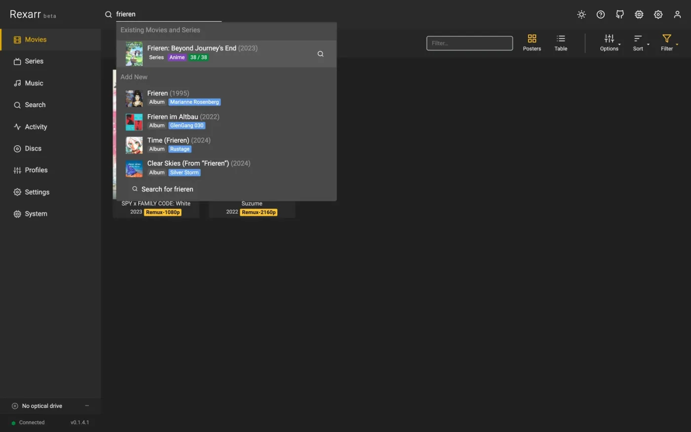
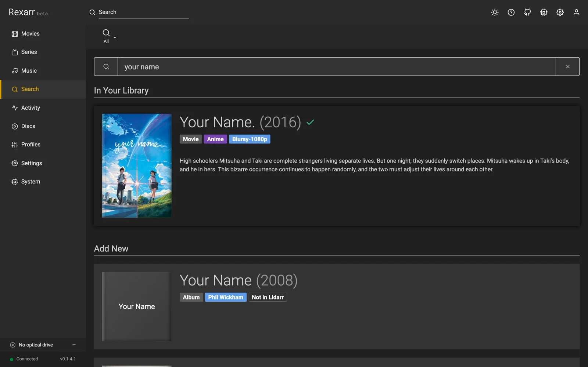

# Search

<figure markdown>
{ decoding=async }
<figcaption>Header search</figcaption>
</figure>

<figure markdown>
{ decoding=async }
<figcaption>Search page</figcaption>
</figure>

Type a title in the header (<kbd>/</kbd>) or on the **Search** page; results appear as you type.

- **In your library** (instant): Radarr + Sonarr titles matched on title, alternate titles and AniDB romaji / kanji,
  typo-tolerant (`interstelar`, `spiderman`, `umaru`), with what is on disk (`Remux-2160p`, `12/24 · 6 remux`).
- **On Disk, Not in \*arr**: matches from the [local media](local-media.md) index.
- **Add new**: TMDB / TVDB via Radarr / Sonarr lookup (ids go straight to `tmdb:` / `tvdb:` / `imdb:`), AniDB romaji
  names resolved to their TVDB / TMDB entry. *Add & search* adds the title (monitored, no automatic search).
- **Music**: with Lidarr connected, a *Music* scope searches artists and albums — see [Music](music.md).

## What the query understands

The query is parsed and shown as chips: year, movie / series, `S01E05` / `1x05` / `season 2` / `- 12`,
`2160p` / `4k`, `remux` / `iso` / `bluray` / `web-dl`, `dv`, `hdr`, `atmos`, `x265`, `dual audio`. Opening a series
pre-selects the season and episode.

Examples: `Frieren S01E05`, `Dune (2021) 4k dv`, `Akira iso`, `tt1856101`, `tmdb:693134`, `tvdb:371572`.

## Release scoring

Releases are classified (Remux › Disc / ISO › Blu-ray encode › WEB › HDTV / DVD), tagged (DV, HDR10+, Atmos,
TrueHD, DTS-HD MA, FLAC, HEVC, 10-bit, Dual audio…) and given a **smart score**:

1. source quality and resolution first,
2. then what the search asked for (`2160p remux dv` boosts matching releases),
3. lossless audio and HDR,
4. seeders,
5. Japanese or dual audio for anime,
6. and a penalty for rejected releases or ones naming another season.

Filter by type and resolution, filter the text (group, `Atmos`, `Japanese`), or sort by size / seeders / age.
**Best** shows remux and disc releases, falling back to everything — best source first — when there are none. Hover
a score to see why it got it.

## Remux only

**Settings → Encoding → Defaults** sets what search shows by default: remux only, remux + disc, disc, or everything.
The filter on the Search page overrides it per search. Full-disc releases are explained under
[Full-disc releases from search](disc-ripping.md#full-disc-releases-from-search).

## Grabbing

**Grab** sends the release to Radarr / Sonarr as usual and creates a Rexarr job that waits for the \*arr app to
import it (*Waiting for import* in [Activity](library.md#activity)), then encodes it with the profile you picked.
Season packs expand into one job per episode. Prowlarr grabs are not tracked — Prowlarr has no library to import
into.
