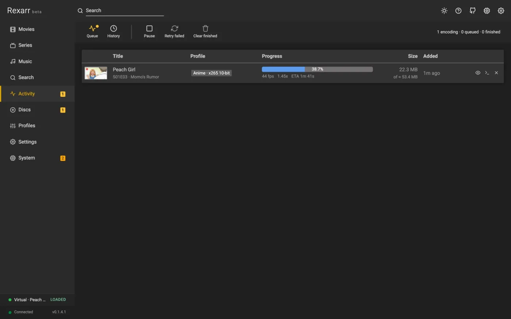
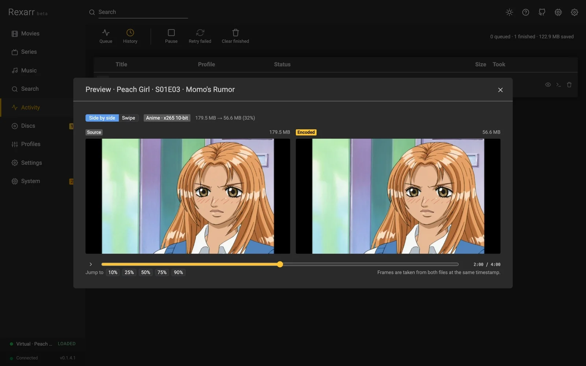

# Transcoding

{ decoding=async }

**Software (CPU) encoding is highly recommended for the best quality.** x265 and SVT-AV1 give noticeably smaller
files at the same visual quality than any hardware encoder, which is what you want when archiving Blu-ray remuxes.
Hardware encoding is many times faster but typically needs 20–40% more bitrate for the same quality; use it for
speed or bulk conversions.

## Hardware acceleration

**Settings → Encoding → Transcoding**:

| Hardware acceleration | Encoders | Device | Where |
| --- | --- | --- | --- |
| None | x264 / x265 / SVT-AV1 | – | everywhere (default) |
| AMD AMF | `h264_amf`, `hevc_amf`, `av1_amf` | default | Windows (Linux with AMF) |
| Nvidia NVENC | `h264_nvenc`, `hevc_nvenc`, `av1_nvenc` | GPU index (`nvidia-smi` detected) | Windows, Linux |
| Intel Quicksync (QSV) | `h264_qsv`, `hevc_qsv`, `av1_qsv` | render node | Windows, Linux |
| Video Acceleration API (VAAPI) | `h264_vaapi`, `hevc_vaapi`, `av1_vaapi` | render node (`/dev/dri/renderD*` detected) | Linux (Intel, AMD) |
| Rockchip MPP (RKMPP) | `h264_rkmpp`, `hevc_rkmpp` | default | Rockchip SoCs (needs e.g. jellyfin-ffmpeg) |
| Apple VideoToolBox | `h264_videotoolbox`, `hevc_videotoolbox` | default | macOS (not in Docker) |
| Video4Linux2 (V4L2) | `h264_v4l2m2m`, `hevc_v4l2m2m` | default | Raspberry Pi / SoCs, bitrate only |

- Profiles written for x264 / x265 / SVT-AV1 are encoded with the selected method's encoder for the same codec;
  quality (CRF → CQ / QP / `global_quality` / `-q:v`) and preset are translated. A codec the method cannot encode
  (for example AV1 on VideoToolbox) stays on the CPU with a warning. Profiles that name a hardware encoder directly
  keep it.
- Set a profile to **Software only (CPU)** in its editor to keep it off the GPU regardless of this setting.
- **Hardware decoding** decodes H.264 / HEVC / AV1 / VP9 on the GPU as well; VAAPI keeps frames on the GPU end to
  end (`scale_vaapi`) unless subtitles are burned in. Other codecs are decoded on the CPU automatically.
- **Fall back to software**: a failed hardware encode is retried on the CPU (logged in the job and under
  System → Events).
- **Test** encodes 3 seconds of a 1080p pattern with the chosen method, device and decoding, and shows the fps or
  the exact ffmpeg error. Methods missing from the ffmpeg build are marked in the dropdown and flagged by the health
  check.
- Docker: pass `/dev/dri` for QSV / VAAPI (the image's ffmpeg includes VAAPI; Intel drivers on amd64). NVENC needs
  an ffmpeg with CUDA and the NVIDIA container runtime. RKMPP / V4L2 need an ffmpeg built for the board. See
  [Docker](../getting-started/docker.md#hardware-encoding).

## The queue

**Settings → Encoding → FFmpeg** holds the queue's own settings:

- **Encodes at a time** — the limit is enforced from the moment a job is created, including while it is still
  probing its file, and can also be changed on the Activity page.
- **Import poll interval** — how often Rexarr asks the \*arr app whether a grabbed release has been imported yet.
- **Write encodes to** — the Transcodes folder (default; moved into place when finished) or next to the output file.
  If the config disk is small, keep the default and point `REXARR_TRANSCODE_DIR` at a bigger volume.
- **Stop stalled encodes after** — fail an encode that makes no progress for this many minutes (a dropped network
  share, a hung GPU driver). 0 never stops it.

When replacing an original, the finished encode is copied next to it before the original is deleted, so a failure
never leaves you with neither file.

## Encode preview

<figure markdown>
{ decoding=async }
<figcaption>Live preview while encoding</figcaption>
</figure>

<figure markdown>
{ decoding=async }
<figcaption>Before / after comparison</figcaption>
</figure>

In **Activity**, an encoding job's thumbnail becomes a live frame (refreshing every few seconds) and the eye button
opens the preview:

- **While encoding**: the current source frame, streamed from a small extra image output on the running ffmpeg
  process (no second decode), next to a frame read from the output file being written, a few seconds behind the
  encoder. MKV / WebM outputs only; MP4 / MOV cannot be read until the encode finishes. Profiles that copy video
  have no live frame.
- **When done**: an exact before / after comparison of source and encode at the same timestamp, side by side or as a
  **swipe** view with a draggable divider, with a timeline slider and jump buttons.

Preview files live in the Transcodes folder and are removed when the job ends. API:
`GET /api/jobs/:id/preview/live.jpg`, `/preview/encoded.jpg`, `/frame?which=source|output&t=&w=`.

## When an encode fails

- The job's **log** has the full ffmpeg command and output — the first ffmpeg error line is also shown on the job.
- **Retry** re-runs it unchanged; *Retry failed* does that for every failed job.
- Hardware failures are retried on the CPU automatically.
- A file the \*arr app reports but Rexarr cannot see is a path mapping problem — see
  [Troubleshooting](../troubleshooting.md).
