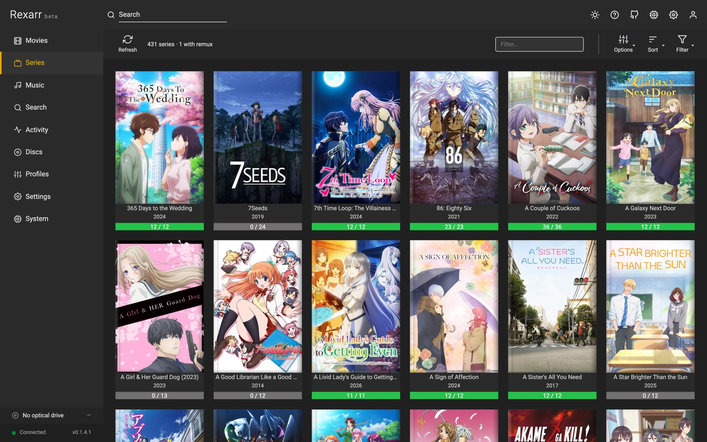
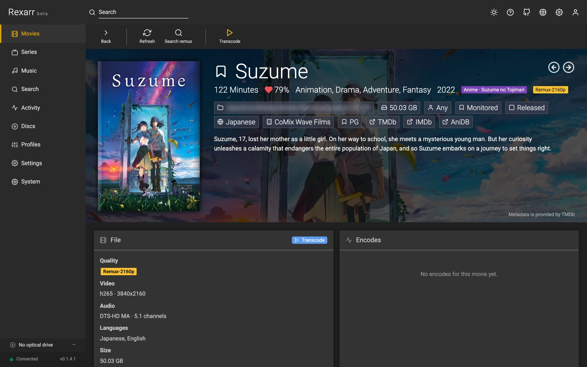
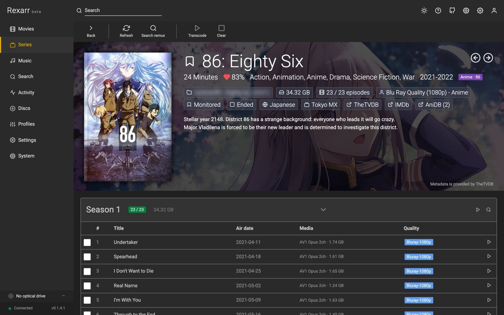
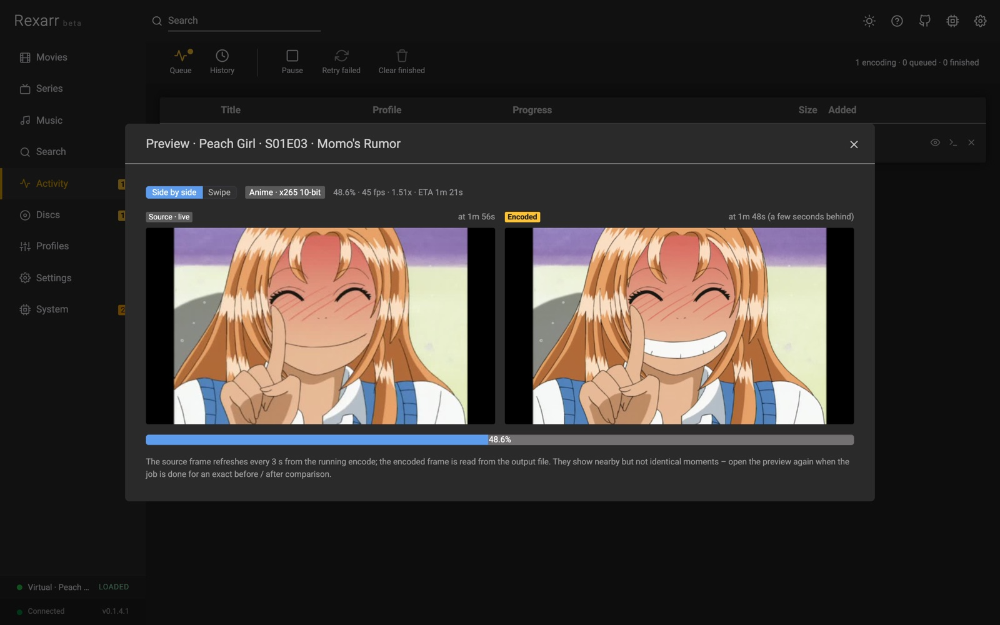
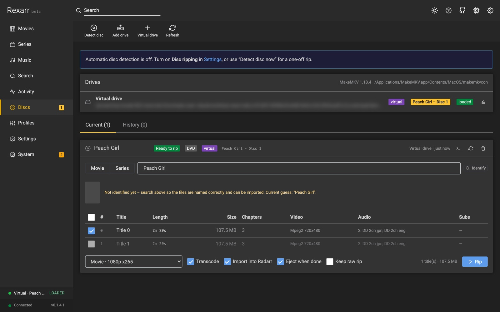

# Rexarr

**Remux-first transcoding, disc ripping and music for the \*arr stack.**

Rexarr sits next to Radarr, Sonarr and Lidarr. It finds Blu-ray remux and full-disc releases for the titles you
choose, re-encodes what the \*arr apps import with FFmpeg — or fre:ac for music — using profiles you control, rips
DVDs and Blu-rays with MakeMKV, splits album images, and indexes media on your disks that none of the \*arr apps
manage.

!!! warning "Rexarr is in beta"
    It works day to day, but settings, file layout and the API can still change between releases, and some
    integrations (Lidarr, Soulseek, audio CD ripping) have seen little real-world use. Keep backups
    (**System → Backup**), read the [release notes](release-notes.md) before updating, and please
    [report what breaks](https://github.com/MoonlightLaboratory/rexarr/issues).

```
Search (Radarr / Sonarr / Prowlarr)  →  remux-only results  →  Grab
        ↓
*arr downloads & imports the remux
        ↓
Rexarr notices the import  →  ffprobe  →  ffmpeg with your profile  →  optional replace + rescan
```

## Start here

- [Requirements](getting-started/requirements.md) — what Rexarr needs on the machine
- [Install from a release](getting-started/install.md) — Windows, macOS, Linux, FreeBSD
- [Docker](getting-started/docker.md) — `ghcr.io/moonlightlaboratory/rexarr`
- [First-time setup](getting-started/setup.md) — connect Radarr / Sonarr and run the first encode

## What it does



| | |
| :---: | :---: |
| <br>Movie details | <br>Series details |
| <br>Encoding profiles | <br>Transcode dialog with estimated size |

- **Web UI in the \*arr style** — Movies, Series, Search, Discs, Music, Activity, Profiles, Settings, System.
  See [Library](guide/library.md).
- **Remux-only search** — interactive search through Radarr / Sonarr (and raw Prowlarr search), filtered to
  `Remux-1080p`, `Remux-2160p`, `Bluray-1080p Remux`, `REMUX` titles, with release scoring.
  See [Search](guide/search.md).
- **Full-disc (ISO) releases** — `BR-DISK`, `COMPLETE.BLURAY`, BD25/50/66/100, BD-ISO, BDMV, DVD5/DVD9/DVDR and
  `VIDEO_TS` releases are recognised, ripped with MakeMKV when the download finishes, then transcoded and imported.
  See [Full-disc releases](guide/disc-ripping.md#full-disc-releases-from-search).
- **Automatic pipeline** — grab a release, Rexarr polls the \*arr app until the file is imported, then queues the
  encode. Season packs expand into one job per episode.
- **Profiles** — container, video encoder, quality, audio, subtitles, output naming, with built-in presets for
  movies, TV, anime and music. See [Profiles](guide/profiles.md).
- **Hardware acceleration** — NVENC, QuickSync, VAAPI, AMF, VideoToolbox, RKMPP, V4L2, with a test button and
  software fallback. See [Transcoding](guide/transcoding.md).
- **Auto transcode** — every new remux Radarr or Sonarr imports, queued with the profile for its type.
  See [Auto transcode](guide/auto-transcode.md).
- **Disc ripping** — insert a disc, Rexarr identifies it against your library, rips it with MakeMKV, encodes it and
  hands it to Radarr / Sonarr with verified imports. See [Disc ripping](guide/disc-ripping.md).
- **Music** — Lidarr library, album search through Lidarr's indexers and Soulseek, audio CD ripping to FLAC with
  MusicBrainz tags, image + cue splitting, and fre:ac music profiles. See [Music](guide/music.md).
- **Local media** — movies, shows and albums on your disks that no \*arr app manages.
  See [Local media](guide/local-media.md).
- **Live progress and preview** — percent, fps, speed, ETA, the full ffmpeg log, a live frame while encoding and a
  before / after comparison when it finishes. See [Encode preview](guide/transcoding.md#encode-preview).

| | |
| :---: | :---: |
| <br>Live preview while encoding | <br>Disc ripping with MakeMKV |

## Help

- [Troubleshooting](troubleshooting.md) — nothing imports, paths not visible, encoder missing, disc not detected
- [Settings reference](reference/settings.md) and [API reference](reference/api.md)
- [Open an issue](https://github.com/MoonlightLaboratory/rexarr/issues) — **System → Status → Report an issue**
  fills in your version for you
- Security problems: see [SECURITY.md](https://github.com/MoonlightLaboratory/rexarr/blob/main/SECURITY.md)
