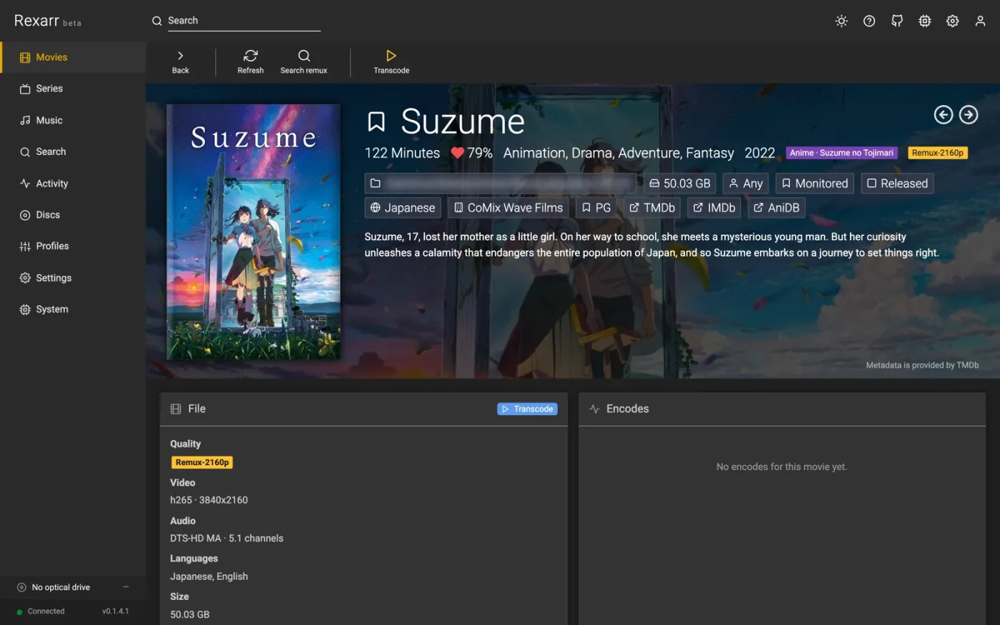
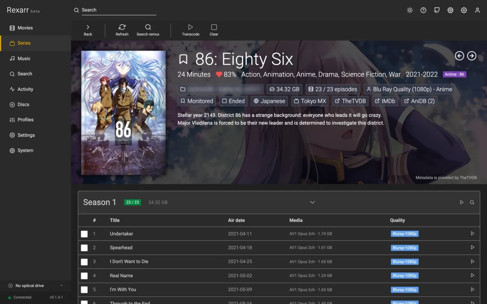
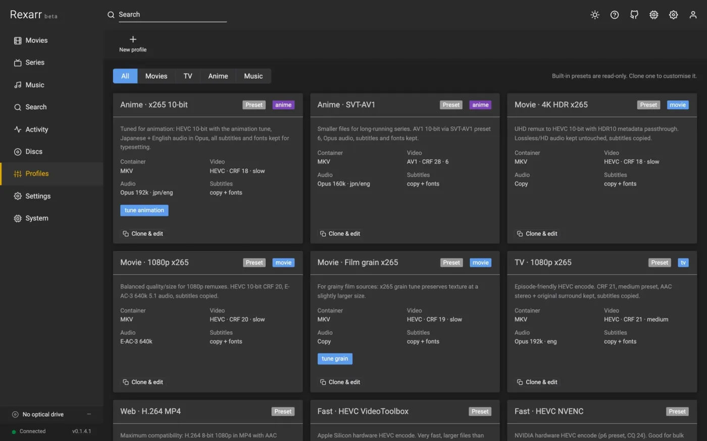
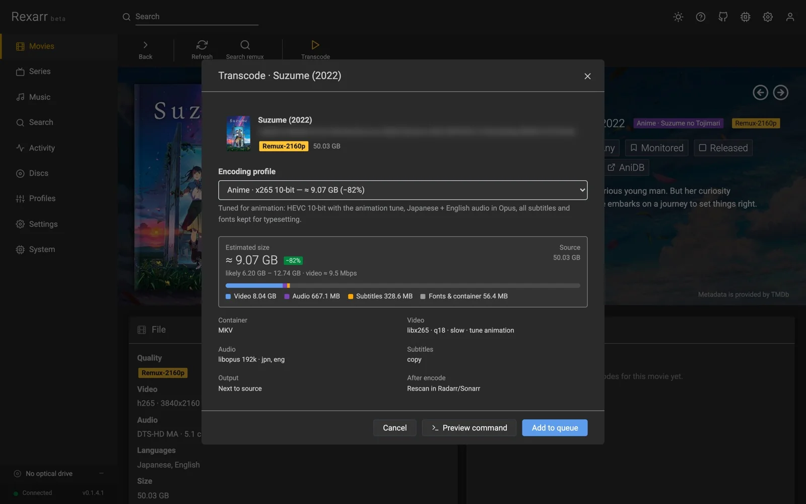

<div class="rx-hero" markdown>

# Rexarr

<p class="rx-tagline">Remux-first transcoding, disc ripping and music for the *arr stack. Rexarr sits next to
Radarr, Sonarr and Lidarr: it finds Blu-ray remux and full-disc releases for the titles you choose, re-encodes what
the *arr apps import with FFmpeg — or fre:ac for music — rips DVDs and Blu-rays with MakeMKV, and indexes the media
on your disks that no *arr app manages.</p>

[Get started](getting-started/index.md){ .md-button .md-button--primary }
[Download a release](https://github.com/MoonlightLaboratory/rexarr/releases){ .md-button }
[GitHub](https://github.com/MoonlightLaboratory/rexarr){ .md-button }

</div>

!!! warning "Rexarr is in beta"
    It works day to day, but settings, file layout and the API can still change between releases, and some
    integrations (Lidarr, Soulseek, audio CD ripping) have seen little real-world use. Keep backups
    (**System → Backup**), read the [release notes](release-notes.md) before updating, and please
    [report what breaks](https://github.com/MoonlightLaboratory/rexarr/issues).

``` title="The pipeline"
Search (Radarr / Sonarr / Prowlarr)  →  remux-only results  →  Grab
        ↓
*arr downloads & imports the remux
        ↓
Rexarr notices the import  →  ffprobe  →  ffmpeg with your profile  →  optional replace + rescan
```

## Start here

<div class="grid cards" markdown>

-   :material-check-circle:{ .lg .middle } **Requirements**

    ---

    FFmpeg, the \*arr apps, and the optional tools for discs and music.

    [:octicons-arrow-right-24: What Rexarr needs](getting-started/requirements.md)

-   :material-download:{ .lg .middle } **Install**

    ---

    Windows installer, macOS app, Linux and FreeBSD tarballs — Node.js included.

    [:octicons-arrow-right-24: Install from a release](getting-started/install.md)

-   :material-docker:{ .lg .middle } **Docker**

    ---

    `ghcr.io/moonlightlaboratory/rexarr`, with `/config`, media mounts and `/dev/dri`.

    [:octicons-arrow-right-24: Run in Docker](getting-started/docker.md)

-   :material-rocket-launch:{ .lg .middle } **First-time setup**

    ---

    Connect Radarr / Sonarr, pick profiles, run the first encode.

    [:octicons-arrow-right-24: Set it up](getting-started/setup.md)

</div>

## What it does

{ decoding=async }

<div class="rx-shots" markdown>

<figure markdown>
{ decoding=async }
<figcaption>Movie details</figcaption>
</figure>

<figure markdown>
{ decoding=async }
<figcaption>Series details</figcaption>
</figure>

<figure markdown>
{ decoding=async }
<figcaption>Encoding profiles</figcaption>
</figure>

<figure markdown>
{ decoding=async }
<figcaption>Transcode with an estimated size</figcaption>
</figure>

</div>

<div class="grid cards" markdown>

-   :material-magnify:{ .lg .middle } **Remux-only search**

    ---

    Interactive search through Radarr / Sonarr and raw Prowlarr search, filtered to remuxes, with a smart score
    that explains itself. Full-disc releases — `BR-DISK`, BD-ISO, BDMV, `VIDEO_TS` — are recognised too.

    [:octicons-arrow-right-24: Search](guide/search.md)

-   :material-tune:{ .lg .middle } **Profiles you control**

    ---

    Container, encoder, quality, audio, subtitles and output naming, with presets for movies, TV, anime and music —
    and a preview of the exact ffmpeg command.

    [:octicons-arrow-right-24: Profiles](guide/profiles.md)

-   :material-expansion-card:{ .lg .middle } **Hardware acceleration**

    ---

    NVENC, QuickSync, VAAPI, AMF, VideoToolbox, RKMPP and V4L2, with a 3-second test button and automatic fallback
    to the CPU.

    [:octicons-arrow-right-24: Transcoding](guide/transcoding.md)

-   :material-disc:{ .lg .middle } **Disc ripping**

    ---

    Insert a disc: Rexarr identifies it against your library, rips it with MakeMKV, encodes it, and hands it to
    Radarr / Sonarr — then checks that it really was imported.

    [:octicons-arrow-right-24: Disc ripping](guide/disc-ripping.md)

-   :material-robot:{ .lg .middle } **Auto transcode**

    ---

    Every new remux Radarr or Sonarr imports, queued with the profile for its type — on a schedule or within
    seconds, via a webhook.

    [:octicons-arrow-right-24: Auto transcode](guide/auto-transcode.md)

-   :material-music:{ .lg .middle } **Music**

    ---

    Lidarr library, album search through indexers and Soulseek, audio CD ripping to FLAC with MusicBrainz tags,
    image + cue splitting, fre:ac profiles.

    [:octicons-arrow-right-24: Music](guide/music.md)

</div>

<div class="rx-shots" markdown>

<figure markdown>
{ decoding=async }
<figcaption>Live preview while encoding</figcaption>
</figure>

<figure markdown>
{ decoding=async }
<figcaption>A DVD scanned by MakeMKV</figcaption>
</figure>

</div>

## Help

- [How it compares](comparison.md) — Automatic Ripping Machine, Tdarr, Unmanic, and doing it by hand
- [Troubleshooting](troubleshooting.md) — nothing imports, paths not visible, an encoder is missing, a disc is not
  detected
- [Settings reference](reference/settings.md) · [System and maintenance](reference/system.md) ·
  [API](reference/api.md)
- [Open an issue](https://github.com/MoonlightLaboratory/rexarr/issues) — **System → Status → Report an issue**
  fills in your version for you
- Security problems: see [SECURITY.md](https://github.com/MoonlightLaboratory/rexarr/blob/main/SECURITY.md)
